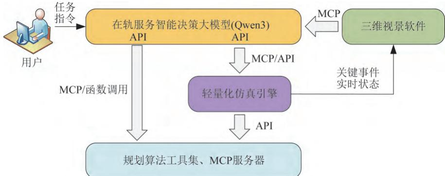
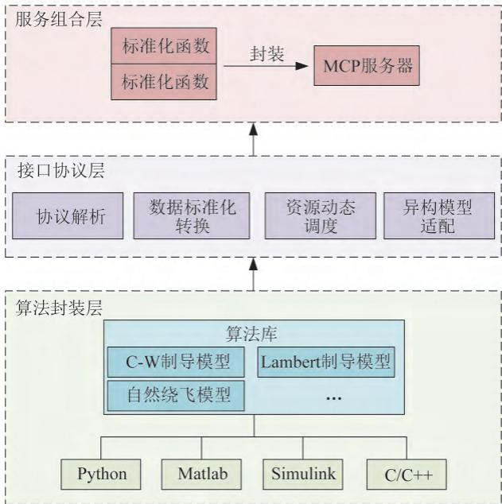
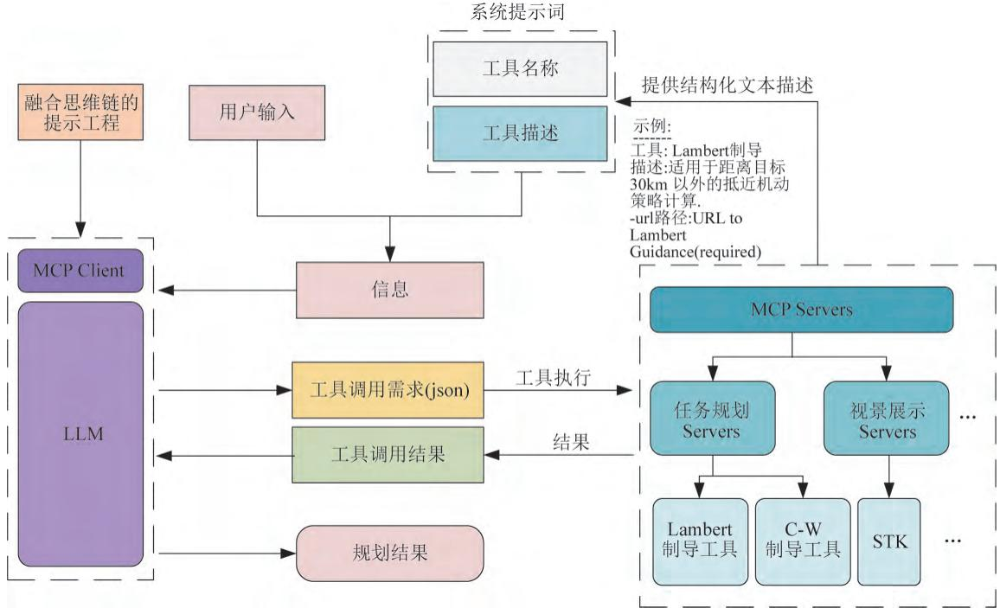

# e2m2e — Earth to Moon, Moon to Earth

[](https://www.apache.org/licenses/LICENSE-2.0)
[](https://www.python.org/)
[](https://pypi.org/project/e2m2e/)
[](https://github.com/cislunarspace/e2m2e/actions/workflows/ci.yml)

e2m2e 是面向地月空间任务规划的**算法工具集基础设施**。在“LLM+Agent”式自主任务规划系统中，大模型负责理解任务意图、分解与编排子任务，e2m2e 负责提供精确可靠的轨道计算工具：建立地月空间的动力学模型，生成周期轨道族，设计轨道之间的转移路径，并把结果画出来检查。

## 安装

### uv（推荐）

[uv](https://docs.astral.sh/uv/) 是本项目推荐的包管理器，速度快、依赖解析可靠。

```bash
uv pip install e2m2e
```

在自己的项目中使用：

```bash
uv init my-project && cd my-project
uv add e2m2e
```

从源码开发（需要 [Rust 工具链](https://www.rust-lang.org/tools/install)，用于构建积分器内核）：

```bash
git clone https://github.com/cislunarspace/e2m2e.git
cd e2m2e
uv sync
```

### conda

e2m2e 没有 conda-forge 包，conda 用来创建和管理 Python 环境，环境内仍用 pip 安装：

```bash
conda create -n e2m2e python=3.12
conda activate e2m2e
pip install e2m2e
```

### pip

```bash
pip install e2m2e
```

可选依赖（Hamiltonian 正规化流水线）：

```bash
pip install e2m2e[normal-form]
```

### SPICE 内核

星历动力学需要 NASA SPICE 内核文件，放置在 `kernels/` 目录或 `$SPICE_KERNEL_DIR` 指定的路径。

国内用户推荐从项目的 [GitHub Release](https://github.com/cislunarspace/e2m2e/releases) 下载：`kernels-v1` 中打包了全部必需内核（行星星历、地球自转、月球姿态、闰秒与行星常数），下载后放入 `kernels/` 目录即可。官方来源（网络可达时）：[NASA NAIF](https://naif.jpl.nasa.gov/naif/data.html)。

## 快速开始

任务级一行接口：设计一条地月 L2 Halo 轨道。内部走完整链路：CR3BP 初猜 → 星历 N 体多重打靶修正 → 高精度长期预报。

> 本示例走星历动力学，运行前请先完成上方「SPICE 内核」一节——仓库根目录 `kernels/` 已含全部必需内核，或设置 `$SPICE_KERNEL_DIR` 指向自备内核目录。

```python
from e2m2e.api import Facade

facade = Facade()  # 默认从仓库 kernels/（或 $SPICE_KERNEL_DIR）加载 SPICE 内核

# 设计一条地月 L2 近直线 Halo 轨道
result = facade.design_orbit(
    orbit_type="Halo",
    collinear_point=2,  # 共线平动点：1 = L1（地月之间），2 = L2（月球背地侧，默认）
    amplitude=30000.0,  # 面外振幅（km，取值 ±73000，正北负南）
    phase=0.0,  # 初始相位（周期份额 0~1）
    epoch=[2024, 1, 1, 0, 0, 0.0],  # 起始历元 UTC：[年,月,日,时,分,秒]
    duration=1.0,  # 维持时间（年）
    output_step=3600.0,  # 星历输出间隔（秒）
)

print("轨道类型        :", result.orbit_type)
print("起始历元 (UTC)  :", result.epoch_utc)
print("维持时间 (天)   :", result.duration_day)
print("CR3BP Jacobi 常数:", f"{result.cr3bp_jacobi:.6f}")
print("星历修正收敛    :", result.correction_converged)
print("星历修正迭代数  :", result.correction_iterations)
print("初始状态 (J2000) :", [f"{v:.6f}" for v in result.initial_state])  # 位置 km + 速度 km/s
print("力模型配置      :", result.force_config)
```

`Facade.design_orbit` 是任务级一档接口（ADR 0014）：把 CR3BP 初猜、星历修正、长期预报串成一条调用。同属 Facade 的能力还有轨道保持 `control_orbit`，以及 DRO/NRHO/Lissajous/L4/L5 等其他轨道类型（改 `orbit_type` 与对应形状参数即可）。

可运行示例见 [`examples/`](examples/) 目录：`main_design.py`（轨道设计）、`main_control.py`（轨道保持）、`main_transfer.py`（转移轨道）、`main_propagate.py`（轨道预报），均支持 `--save` 存图为 PNG。更多示例（星历动力学、多重打靶、转移设计、可视化）见[在线文档](https://cislunarspace.github.io/e2m2e/)。需要 DFH 格式标称星历文件时，可用 `e2m2e.algorithm.design.design_orbit`（其返回结果含 `ephemeris` 与 `write_ephemeris`）。

## 使命与进度

航天任务规划正从“人在回路”走向自主规划。传统模式依赖地面人员逐级分解任务、调配资源，决策链条冗长，单次在轨服务任务的地面支持普遍在十余个小时。李胤慷等在[《基于“LLM+Agent”的在轨服务自主任务规划技术》](https://doi.org/10.19328/j.cnki.2096-8655.2026.01.016)（上海航天，2026）中提出了新架构：大模型负责语义理解、任务分解与编排，专业算法工具负责精确计算，两者通过 MCP 协议协同，分钟级生成全流程任务规划方案。



这套架构能否落地，关键在算法工具集。大模型是概率生成模型，自身做不了精确轨道计算，它输出的方案是否可信，取决于所调用工具的精度与可靠性。没有标准化、经过验证、可被调用的算法工具集，自主规划就是空中楼阁。

这里有一个容易产生的误解需要说清。用户把任务需求和相关信息输入大模型，大模型调用工具求解问题，最终呈现的结果并非大模型自身生成，而是工具计算得出的。大模型做的只是把工具的输出整理成便于人阅读和理解的形式。看起来像是模型直接根据输入生成了答案，实际上这些结果既不是大模型算出来的，也不是它推理出来的，而是工具的运算输出。因此，工具集的质量决定了整个系统的质量，这正是 e2m2e 要守住的地方。



地月空间是这套范式最重要的应用场景之一，空间站、导航与通信星座、月面往返都从这里起步。e2m2e 的使命是建设地月空间方向的算法工具集基础设施，把轨道建模、轨道生成、转移设计等算法做成精确、标准化、可被上层规划系统调用的开源工具库。上图中算法封装层与接口协议层的能力，正是 e2m2e 已经建成和正在补齐的部分。

**已经建成：**

- 两套动力学模型：简化三体模型（CR3BP，用于快速设计）和高精度星历模型（基于 SPICE，用于精确外推），以及两者之间的转换；另有含太阳摄动的双圆四体模型（BCR4BP），太阳位置解析给出，无需星历
- 周期轨道族生成：DRO、Halo、Lyapunov、Lissajous、Butterfly、Dragonfly、共振轨道（RO）等，配微分修正、多重打靶、延拓等数值算法
- 高精度力模型：点质量与第三体引力、球谐重力场（含固体潮）、大气阻力、太阳光压、连续推力，传播精度已与 GMAT、DFH 对齐到亚百米级
- 转移轨道设计：Lambert 求解与 porkchop 扫描，多脉冲转移优化与 Lawden 主矢量检验，网格搜索 + 非线性规划的两步法
- 事件检测：轨道传播中检测截面穿越等事件，支持 terminal/direction 语义，提供 scipy 接口与 Rust 快速路径
- 不变流形与低能量转移：流形计算、庞加莱截面拼接、低能转移流水线
- 坐标系转换（J2000/ITRF 等，与 GMAT 兼容）和 2D/3D 可视化

**正在进行和计划中的：**

- 更多轨道族：DPO、三角平动点附近的 SPO/LPO、Horseshoe 等
- 小推力转移与 LEO/GEO 端点条件
- Hamiltonian 正规化流水线的进一步完善（把平动点附近轨道化简为少数表征参数）
- 面向上层规划系统的服务化封装。下一步把 e2m2e 封装为 MCP 服务器，接入下图所示的异构模型交互框架，让大模型可以像调用 Lambert、C-W 工具一样调用地月轨道算法



### 能力与实现状态

| 能力 | 实现状态 | 说明 |
|------|---------|------|
| 任务轨道设计（DRO/NRHO/Halo/Lissajous/L4/L5） | 已实现 | CR3BP 初猜 → 星历修正 → 高精度预报全链路 |
| 轨道保持（特征点/目标点严格/目标点宽松 + 蒙特卡洛） | 已实现 | 三控制律 + 三轨道误差仿真 |
| 角动量管理 | 未实现 | 姿态发动机联合控制（见 issue #261） |
| 转移轨道设计（HMN） | 已实现 | Lambert + 打靶组装 |
| 转移轨道设计（LGA/WSB） | 未实现 | 引力辅助弹道搜索 |
| 低推力转移 | 已实现 | Q-law 初猜 + 打靶/配点/解析雅可比 |
| 轨道预报 | 已实现 | ForceModel 高精度外推 |
| 时空坐标转换（TDT+GCRS↔TDB+EBCRS） | 已实现 | r2s2 后端 |
| ECOM 光压模型 | 未实现 | 现有仅炮弹模型（见 issue #253） |
| 地球非球形×大天体耦合项 | 未实现 | 见 issue #253 |
| 不变流形与低能量转移 | 已实现 | 流形 + 庞加莱截面 + 拼接 |
| 正规化（normal form） | 已实现 | 可选依赖 `[normal-form]` |
| MCP 服务 | 部分实现 | Facade 方法全集（`mcp_exposed`）可派生；`create_server`/`e2m2e mcp-serve` 占位，部署依赖 `[mcp]` extra |

详细的能力清单与 API 文档见[在线文档](https://cislunarspace.github.io/e2m2e/)；逐版本变更见 [CHANGELOG.md](CHANGELOG.md)。

## 文档

在线文档：<https://cislunarspace.github.io/e2m2e/>

本地构建：

```bash
uv sync --group docs
uv run sphinx-build -b html docs docs/_build/html
```

## 测试与代码规范

```bash
uv run pytest tests/
uv run ruff check .
```

## 贡献

1. Fork 本仓库
2. 创建功能分支 (`git checkout -b feature/amazing-feature`)
3. 提交更改 (`git commit -m 'Add amazing feature'`)
4. 推送到分支 (`git push origin feature/amazing-feature`)
5. 开启 Pull Request

## 引用

```bibtex
@software{e2m2e,
  title = {e2m2e: Earth to Moon, Moon to Earth Transfer Orbit Design Library},
  author = {ouyangjiahong},
  email = {ouyangjiahong22@nudt.edu.cn},
  url = {https://github.com/cislunarspace/e2m2e},
  version = {5.4.0},
  year = {2026},
}
```

使命叙述依据的文献：

> 李胤慷, 王浩, 袁容昊, 等. 基于“LLM+Agent”的在轨服务自主任务规划技术[J]. 上海航天（中英文）, 2026, 43(1): 169-179. DOI: [10.19328/j.cnki.2096-8655.2026.01.016](https://doi.org/10.19328/j.cnki.2096-8655.2026.01.016).

## License

[Apache 2.0](LICENSE)
