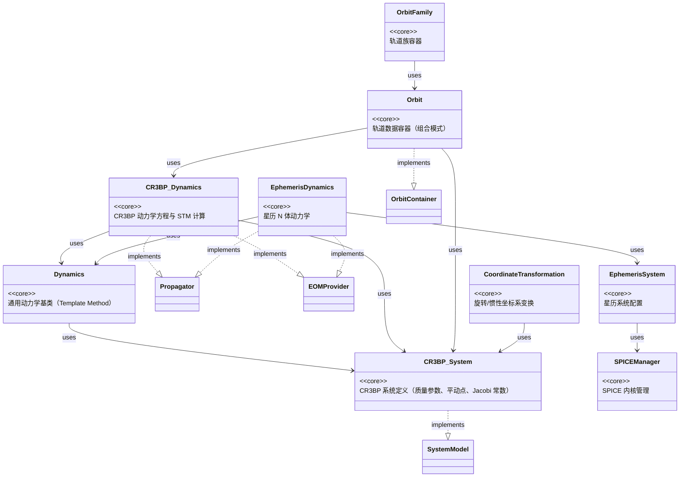

```mermaid
classDiagram
    class CR3BP_System {
        &lt;&lt;core&gt;&gt;
        CR3BP 系统定义（质量参数、平动点、Jacobi 常数）
    }
    CR3BP_System ..|> SystemModel : implements
    class Dynamics {
        &lt;&lt;core&gt;&gt;
        通用动力学基类（Template Method）
    }
    Dynamics --> CR3BP_System : uses
    class CR3BP_Dynamics {
        &lt;&lt;core&gt;&gt;
        CR3BP 动力学方程与 STM 计算
    }
    CR3BP_Dynamics ..|> Propagator : implements
    CR3BP_Dynamics ..|> EOMProvider : implements
    CR3BP_Dynamics --> Dynamics : uses
    CR3BP_Dynamics --> CR3BP_System : uses
    class EphemerisDynamics {
        &lt;&lt;core&gt;&gt;
        星历 N 体动力学
    }
    EphemerisDynamics ..|> Propagator : implements
    EphemerisDynamics ..|> EOMProvider : implements
    EphemerisDynamics --> Dynamics : uses
    EphemerisDynamics --> EphemerisSystem : uses
    class Orbit {
        &lt;&lt;core&gt;&gt;
        轨道数据容器（组合模式）
    }
    Orbit ..|> OrbitContainer : implements
    Orbit --> CR3BP_System : uses
    Orbit --> CR3BP_Dynamics : uses
    class OrbitFamily {
        &lt;&lt;core&gt;&gt;
        轨道族容器
    }
    OrbitFamily --> Orbit : uses
    class CoordinateTransformation {
        &lt;&lt;core&gt;&gt;
        旋转/惯性坐标系变换
    }
    CoordinateTransformation --> CR3BP_System : uses
    class SPICEManager {
        &lt;&lt;core&gt;&gt;
        SPICE 内核管理
    }
    class EphemerisSystem {
        &lt;&lt;core&gt;&gt;
        星历系统配置
    }
    EphemerisSystem --> SPICEManager : uses
```
