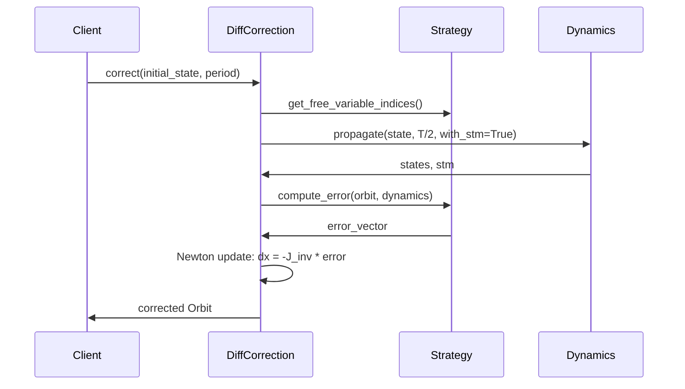

```mermaid
sequenceDiagram
    participant Client
    participant DiffCorrection
    participant Strategy
    participant Dynamics
    Client->>DiffCorrection: correct(initial_state, period)
    DiffCorrection->>Strategy: get_free_variable_indices()
    DiffCorrection->>Dynamics: propagate(state, T/2, with_stm=True)
    Dynamics->>DiffCorrection: states, stm
    DiffCorrection->>Strategy: compute_error(orbit, dynamics)
    Strategy->>DiffCorrection: error_vector
    DiffCorrection->>DiffCorrection: Newton update: dx = -J_inv * error
    DiffCorrection->>Client: corrected Orbit
```
