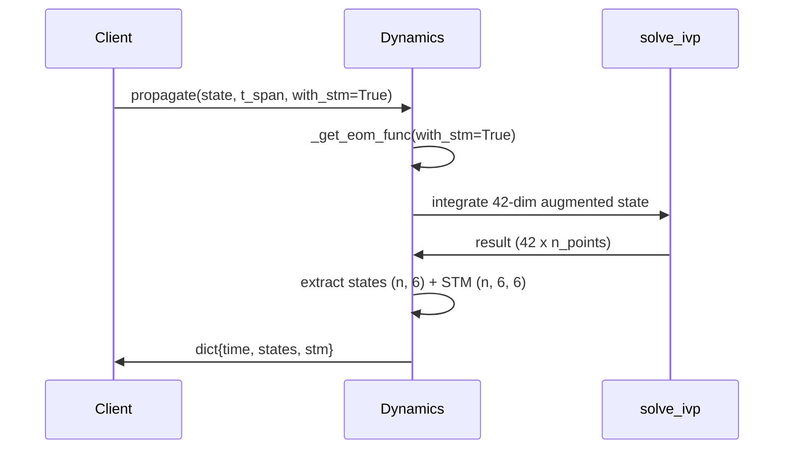

```mermaid
sequenceDiagram
    participant Client
    participant Dynamics
    participant solve_ivp
    Client->>Dynamics: propagate(state, t_span, with_stm=True)
    Dynamics->>Dynamics: _get_eom_func(with_stm=True)
    Dynamics->>solve_ivp: integrate 42-dim augmented state
    solve_ivp->>Dynamics: result (42 x n_points)
    Dynamics->>Dynamics: extract states (n, 6) + STM (n, 6, 6)
    Dynamics->>Client: dict{time, states, stm}
```
