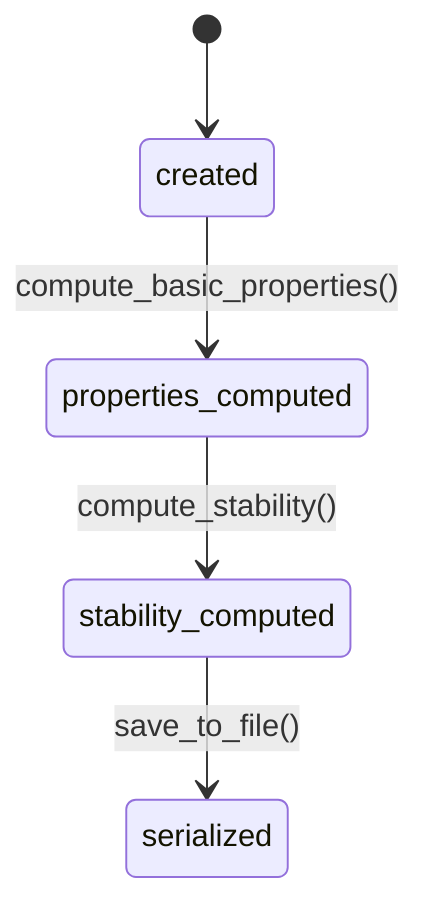

```mermaid
stateDiagram-v2
    [*] --> created
    created --> properties_computed : compute_basic_properties()
    properties_computed --> stability_computed : compute_stability()
    stability_computed --> serialized : save_to_file()
```
