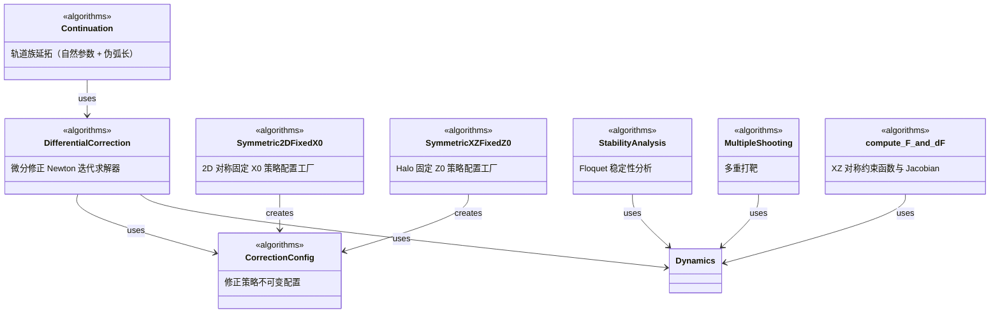

```mermaid
classDiagram
    class DifferentialCorrection {
        <<algorithms>>
        微分修正 Newton 迭代求解器
    }
    DifferentialCorrection --> Dynamics : uses
    DifferentialCorrection --> CorrectionConfig : uses
    class CorrectionConfig {
        <<algorithms>>
        修正策略不可变配置
    }
    class Symmetric2DFixedX0 {
        <<algorithms>>
        2D 对称固定 X0 策略配置工厂
    }
    Symmetric2DFixedX0 --> CorrectionConfig : creates
    class SymmetricXZFixedZ0 {
        <<algorithms>>
        Halo 固定 Z0 策略配置工厂
    }
    SymmetricXZFixedZ0 --> CorrectionConfig : creates
    class Continuation {
        <<algorithms>>
        轨道族延拓（自然参数 + 伪弧长）
    }
    Continuation --> DifferentialCorrection : uses
    class StabilityAnalysis {
        <<algorithms>>
        Floquet 稳定性分析
    }
    StabilityAnalysis --> Dynamics : uses
    class MultipleShooting {
        <<algorithms>>
        多重打靶
    }
    MultipleShooting --> Dynamics : uses
    class compute_F_and_dF {
        <<algorithms>>
        XZ 对称约束函数与 Jacobian
    }
    compute_F_and_dF --> Dynamics : uses
```
