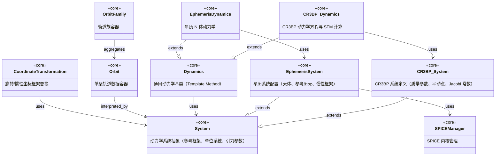

```mermaid
classDiagram
    class System {
        <<core>>
        动力学系统抽象（参考框架、单位系统、引力参数）
    }
    class CR3BP_System {
        <<core>>
        CR3BP 系统定义（质量参数、平动点、Jacobi 常数）
    }
    CR3BP_System --|> System : extends
    class EphemerisSystem {
        <<core>>
        星历系统配置（天体、参考历元、惯性框架）
    }
    EphemerisSystem --|> System : extends
    class Dynamics {
        <<core>>
        通用动力学基类（Template Method）
    }
    Dynamics --> System : uses
    class CR3BP_Dynamics {
        <<core>>
        CR3BP 动力学方程与 STM 计算
    }
    CR3BP_Dynamics --|> Dynamics : extends
    CR3BP_Dynamics --> CR3BP_System : uses
    class EphemerisDynamics {
        <<core>>
        星历 N 体动力学
    }
    EphemerisDynamics --|> Dynamics : extends
    EphemerisDynamics --> EphemerisSystem : uses
    class Orbit {
        <<core>>
        单条轨道数据容器
    }
    Orbit --> System : interpreted_by
    class OrbitFamily {
        <<core>>
        轨道族容器
    }
    OrbitFamily --> Orbit : aggregates
    class CoordinateTransformation {
        <<core>>
        旋转/惯性坐标框架变换
    }
    CoordinateTransformation --> System : uses
    class SPICEManager {
        <<core>>
        SPICE 内核管理
    }
    EphemerisSystem --> SPICEManager : uses
```
