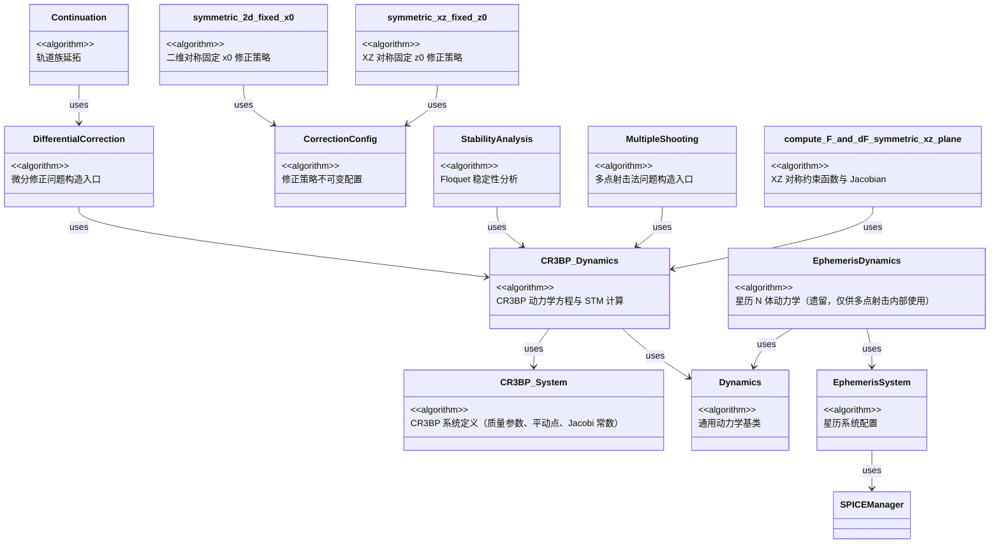

# BDD：算法层 / BDD: Algorithm Layer

[English] Block definition diagram of dynamics, correction and continuation components.

[简体中文] 受管产物：由 `scripts/generate_mbse_diagrams.py` 重新生成，请勿手改。

```mermaid
classDiagram
    class CR3BP_System {
        &lt;&lt;algorithm&gt;&gt;
        CR3BP 系统定义（质量参数、平动点、Jacobi 常数）
    }
    class Dynamics {
        &lt;&lt;algorithm&gt;&gt;
        通用动力学基类
    }
    class CR3BP_Dynamics {
        &lt;&lt;algorithm&gt;&gt;
        CR3BP 动力学方程与 STM 计算
    }
    CR3BP_Dynamics --> Dynamics : uses
    CR3BP_Dynamics --> CR3BP_System : uses
    class EphemerisSystem {
        &lt;&lt;algorithm&gt;&gt;
        星历系统配置
    }
    EphemerisSystem --> SPICEManager : uses
    class EphemerisDynamics {
        &lt;&lt;algorithm&gt;&gt;
        星历 N 体动力学（遗留，仅供多点射击内部使用）
    }
    EphemerisDynamics --> Dynamics : uses
    EphemerisDynamics --> EphemerisSystem : uses
    class DifferentialCorrection {
        &lt;&lt;algorithm&gt;&gt;
        微分修正问题构造入口
    }
    DifferentialCorrection --> CR3BP_Dynamics : uses
    class CorrectionConfig {
        &lt;&lt;algorithm&gt;&gt;
        修正策略不可变配置
    }
    class symmetric_2d_fixed_x0 {
        &lt;&lt;algorithm&gt;&gt;
        二维对称固定 x0 修正策略
    }
    symmetric_2d_fixed_x0 --> CorrectionConfig : uses
    class symmetric_xz_fixed_z0 {
        &lt;&lt;algorithm&gt;&gt;
        XZ 对称固定 z0 修正策略
    }
    symmetric_xz_fixed_z0 --> CorrectionConfig : uses
    class Continuation {
        &lt;&lt;algorithm&gt;&gt;
        轨道族延拓
    }
    Continuation --> DifferentialCorrection : uses
    class StabilityAnalysis {
        &lt;&lt;algorithm&gt;&gt;
        Floquet 稳定性分析
    }
    StabilityAnalysis --> CR3BP_Dynamics : uses
    class MultipleShooting {
        &lt;&lt;algorithm&gt;&gt;
        多点射击法问题构造入口
    }
    MultipleShooting --> CR3BP_Dynamics : uses
    class compute_F_and_dF_symmetric_xz_plane {
        &lt;&lt;algorithm&gt;&gt;
        XZ 对称约束函数与 Jacobian
    }
    compute_F_and_dF_symmetric_xz_plane --> CR3BP_Dynamics : uses
```
