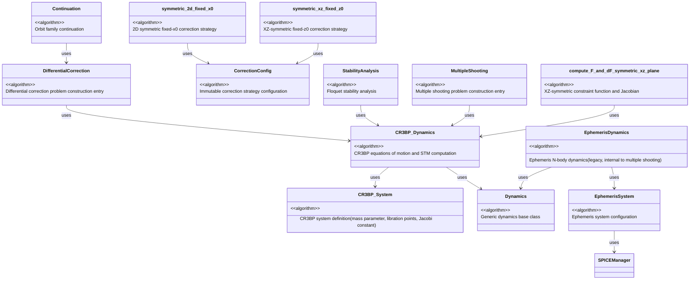

# BDD: Algorithm Layer

Block definition diagram of dynamics, correction and continuation components.

Managed artifact: regenerated by `scripts/generate_mbse_diagrams.py`; do not hand-edit.

```mermaid
classDiagram
    class CR3BP_System {
        &lt;&lt;algorithm&gt;&gt;
        CR3BP system definition (mass parameter, libration points, Jacobi constant)
    }
    class Dynamics {
        &lt;&lt;algorithm&gt;&gt;
        Generic dynamics base class
    }
    class CR3BP_Dynamics {
        &lt;&lt;algorithm&gt;&gt;
        CR3BP equations of motion and STM computation
    }
    CR3BP_Dynamics --> Dynamics : uses
    CR3BP_Dynamics --> CR3BP_System : uses
    class EphemerisSystem {
        &lt;&lt;algorithm&gt;&gt;
        Ephemeris system configuration
    }
    EphemerisSystem --> SPICEManager : uses
    class EphemerisDynamics {
        &lt;&lt;algorithm&gt;&gt;
        Ephemeris N-body dynamics (legacy, internal to multiple shooting)
    }
    EphemerisDynamics --> Dynamics : uses
    EphemerisDynamics --> EphemerisSystem : uses
    class DifferentialCorrection {
        &lt;&lt;algorithm&gt;&gt;
        Differential correction problem construction entry
    }
    DifferentialCorrection --> CR3BP_Dynamics : uses
    class CorrectionConfig {
        &lt;&lt;algorithm&gt;&gt;
        Immutable correction strategy configuration
    }
    class symmetric_2d_fixed_x0 {
        &lt;&lt;algorithm&gt;&gt;
        2D symmetric fixed-x0 correction strategy
    }
    symmetric_2d_fixed_x0 --> CorrectionConfig : uses
    class symmetric_xz_fixed_z0 {
        &lt;&lt;algorithm&gt;&gt;
        XZ-symmetric fixed-z0 correction strategy
    }
    symmetric_xz_fixed_z0 --> CorrectionConfig : uses
    class Continuation {
        &lt;&lt;algorithm&gt;&gt;
        Orbit family continuation
    }
    Continuation --> DifferentialCorrection : uses
    class StabilityAnalysis {
        &lt;&lt;algorithm&gt;&gt;
        Floquet stability analysis
    }
    StabilityAnalysis --> CR3BP_Dynamics : uses
    class MultipleShooting {
        &lt;&lt;algorithm&gt;&gt;
        Multiple shooting problem construction entry
    }
    MultipleShooting --> CR3BP_Dynamics : uses
    class compute_F_and_dF_symmetric_xz_plane {
        &lt;&lt;algorithm&gt;&gt;
        XZ-symmetric constraint function and Jacobian
    }
    compute_F_and_dF_symmetric_xz_plane --> CR3BP_Dynamics : uses
```
