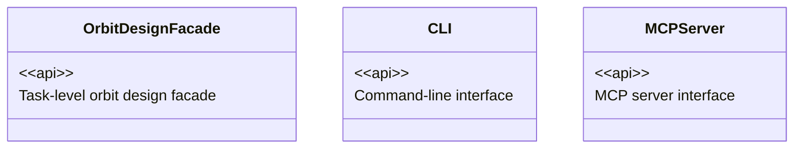

# BDD: Interface Layer

Block definition diagram of Facade, CLI and MCP interfaces.

Managed artifact: regenerated by `scripts/generate_mbse_diagrams.py`; do not hand-edit.

```mermaid
classDiagram
    class OrbitDesignFacade {
        &lt;&lt;api&gt;&gt;
        Task-level orbit design facade
    }
    class CLI {
        &lt;&lt;api&gt;&gt;
        Command-line interface
    }
    class MCPServer {
        &lt;&lt;api&gt;&gt;
        MCP server interface
    }
```
