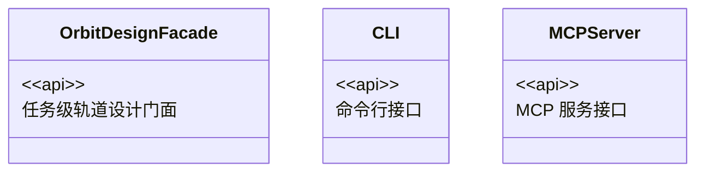

# BDD：接口层 / BDD: Interface Layer

[English] Block definition diagram of Facade, CLI and MCP interfaces.

[简体中文] 受管产物：由 scripts/generate_mbse_diagrams.py 重新生成，请勿手改。

```mermaid
classDiagram
    class OrbitDesignFacade {
        &lt;&lt;api&gt;&gt;
        任务级轨道设计门面
    }
    class CLI {
        &lt;&lt;api&gt;&gt;
        命令行接口
    }
    class MCPServer {
        &lt;&lt;api&gt;&gt;
        MCP 服务接口
    }
```
