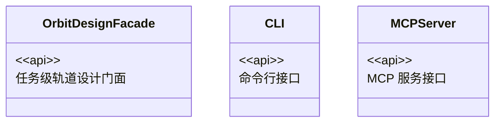

# BDD：接口层

```mermaid
classDiagram
    class OrbitDesignFacade {
        &lt;&lt;api&gt;&gt;
        任务级轨道设计门面
    }
    class CLI {
        &lt;&lt;api&gt;&gt;
        命令行接口
    }
    class MCPServer {
        &lt;&lt;api&gt;&gt;
        MCP 服务接口
    }
```
