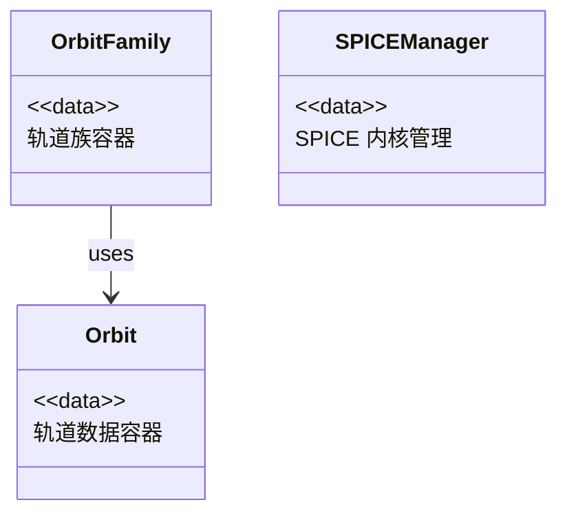

# BDD：数据层

```mermaid
classDiagram
    class Orbit {
        &lt;&lt;data&gt;&gt;
        轨道数据容器
    }
    class OrbitFamily {
        &lt;&lt;data&gt;&gt;
        轨道族容器
    }
    OrbitFamily --> Orbit : uses
    class SPICEManager {
        &lt;&lt;data&gt;&gt;
        SPICE 内核管理
    }
```
