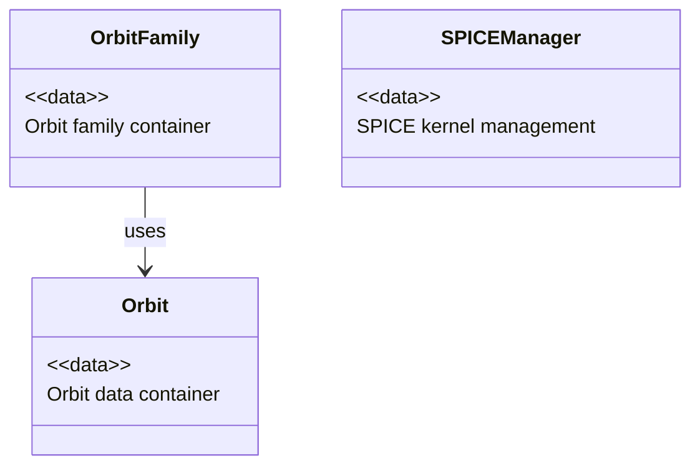

# BDD: Data Layer

Block definition diagram of data-layer components: containers, kernels and constants.

Managed artifact: regenerated by `scripts/generate_mbse_diagrams.py`; do not hand-edit.

```mermaid
classDiagram
    class Orbit {
        &lt;&lt;data&gt;&gt;
        Orbit data container
    }
    class OrbitFamily {
        &lt;&lt;data&gt;&gt;
        Orbit family container
    }
    OrbitFamily --> Orbit : uses
    class SPICEManager {
        &lt;&lt;data&gt;&gt;
        SPICE kernel management
    }
```
