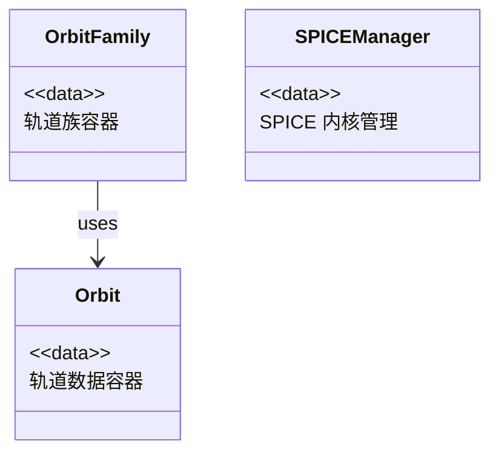

# BDD：数据层 / BDD: Data Layer

[English] Block definition diagram of data-layer components: containers, kernels and constants.

[简体中文] 受管产物：由 `scripts/generate_mbse_diagrams.py` 重新生成，请勿手改。

```mermaid
classDiagram
    class Orbit {
        &lt;&lt;data&gt;&gt;
        轨道数据容器
    }
    class OrbitFamily {
        &lt;&lt;data&gt;&gt;
        轨道族容器
    }
    OrbitFamily --> Orbit : uses
    class SPICEManager {
        &lt;&lt;data&gt;&gt;
        SPICE 内核管理
    }
```
