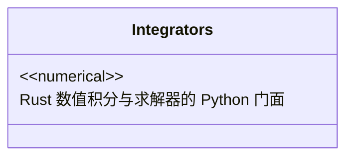

# BDD：数值层 / BDD: Numerical Layer

[English] Block definition diagram of the Rust numerical computation facade.

[简体中文] 受管产物：由 scripts/generate_mbse_diagrams.py 重新生成，请勿手改。

```mermaid
classDiagram
    class Integrators {
        &lt;&lt;numerical&gt;&gt;
        Rust 数值积分与求解器的 Python 门面
    }
```
