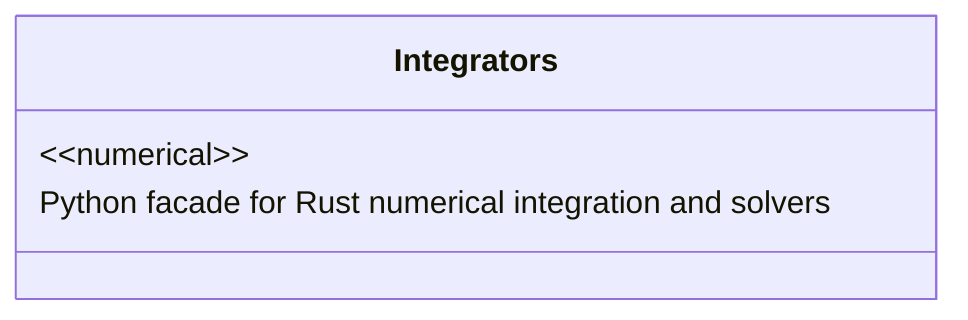

# BDD: Numerical Layer

Block definition diagram of the Rust numerical computation facade.

Managed artifact: regenerated by `scripts/generate_mbse_diagrams.py`; do not hand-edit.

```mermaid
classDiagram
    class Integrators {
        &lt;&lt;numerical&gt;&gt;
        Python facade for Rust numerical integration and solvers
    }
```
