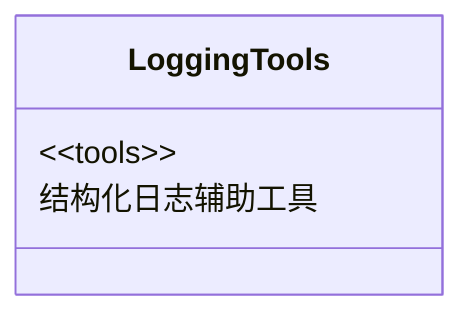

# BDD：工具层 / BDD: Tools Layer

[English] Block definition diagram of auxiliary tools such as logging.

[简体中文] 受管产物：由 `scripts/generate_mbse_diagrams.py` 重新生成，请勿手改。

```mermaid
classDiagram
    class LoggingTools {
        &lt;&lt;tools&gt;&gt;
        结构化日志辅助工具
    }
```
