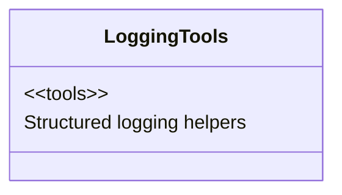

# BDD: Tools Layer

Block definition diagram of auxiliary tools such as logging.

Managed artifact: regenerated by `scripts/generate_mbse_diagrams.py`; do not hand-edit.

```mermaid
classDiagram
    class LoggingTools {
        &lt;&lt;tools&gt;&gt;
        Structured logging helpers
    }
```
