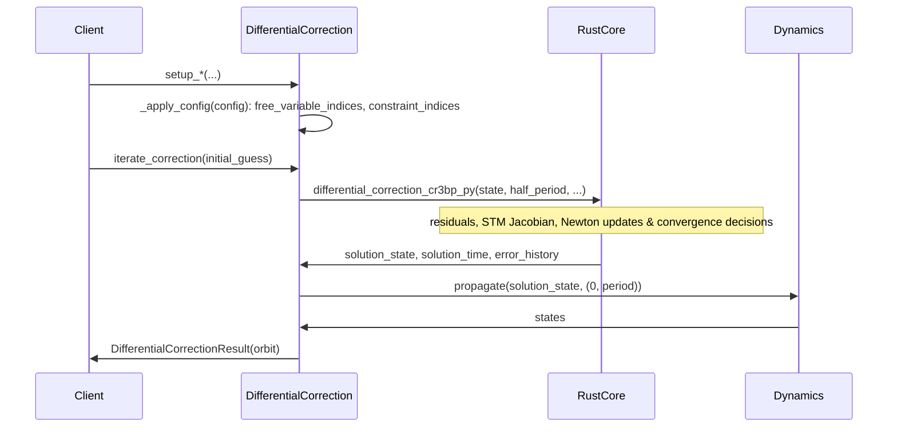

# Correction Sequence

```mermaid
sequenceDiagram
    participant Client
    participant DifferentialCorrection
    participant RustCore
    participant Dynamics
    Client->>DifferentialCorrection: setup_*(...)
    DifferentialCorrection->>DifferentialCorrection: _apply_config(config): free_variable_indices, constraint_indices
    Client->>DifferentialCorrection: iterate_correction(initial_guess)
    DifferentialCorrection->>RustCore: differential_correction_cr3bp_py(state, half_period, ...)
    Note over RustCore: residuals, STM Jacobian, Newton updates & convergence decisions
    RustCore->>DifferentialCorrection: solution_state, solution_time, error_history
    DifferentialCorrection->>Dynamics: propagate(solution_state, (0, period))
    Dynamics->>DifferentialCorrection: states
    DifferentialCorrection->>Client: DifferentialCorrectionResult(orbit)
```
