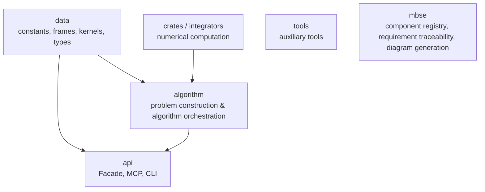
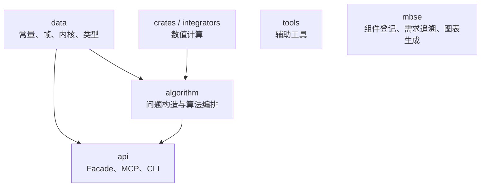

# e2m2e MBSE Model Overview / e2m2e MBSE 模型总览

[English](#english) | [简体中文](#中文)

## English

### What MBSE is

**MBSE (Model-Based Systems Engineering)** is a systems-engineering approach
centered on formal models spanning requirements, design, analysis, verification,
and validation across the whole lifecycle. e2m2e doesn't provide a full
systems-engineering process; it borrows the traceability mindset inside this
repo.

The MBSE model carries four duties:

- **Component registration** (`ComponentRegistry`) records components, their
  architecture layers, and component dependencies;
- **Requirement traceability** (`RequirementRegistry`) links requirements to code
  modules and test files;
- **Data models** (Pydantic) express MBSE's own data contracts;
- **Diagram generation** (`DiagramGenerator`) produces Mermaid diagrams and the
  traceability matrix from registered models.

BDDs, the requirements diagram, and the traceability matrix are managed,
generated artifacts. After re-running the MBSE documentation generation script,
committed artifacts must remain unchanged; activity/sequence/state diagrams are
supplementary narrative outside that generation check.

### Architecture layers

Runtime code follows ADR 0011's five-layer architecture; MBSE is an independent
top-level architecture-metadata subsystem outside the runtime dependency chain:

| Layer | Responsibility |
|----|------|
| data | spacetime references, physical constants, SPICE kernels, data containers |
| numerical | Rust numerical computation + Python bindings |
| algorithm | dynamics, correction, continuation, stability, mission problem construction |
| api | Facade, MCP, CLI & boundary models |
| tools | auxiliary capabilities not depended on by core runtime code |
| mbse | component registry, requirement traceability, Pydantic models, doc generation |

### Current seams

ADR 0001 withdrew decorative Protocol seams. MBSE describes existing module
relations via two registries plus one generator:

| Seam | Interface | Purpose |
|------|------|------|
| Default model assembly | `register_default_model` | Registers official requirements & component catalog into caller-provided registries |
| Component registration | `ComponentRegistry` | Aggregates components' module locations, architecture layers, dependencies |
| Requirement traceability | `RequirementRegistry` | Connects requirements to code modules & test files |
| Documentation generation | `DiagramGenerator` | Generates BDDs, requirement diagrams, traceability matrix from registered models |

### Data models

| Model | Purpose |
|------|------|
| `OrbitProperties` | Orbit properties: period, amplitude, extremes, mean state, center & periodicity |

`OrbitProperties.mean_state` is a shape-`(6,)` state vector; `center` a shape-
`(3,)` position vector. The model validates these public contracts at
construction.

### Managed artifacts

| Document | Content |
|------|------|
| [Data-layer BDD](generated/bdd-data.md) | Data containers & SPICE kernel management components |
| [Numerical-layer BDD](generated/bdd-numerical.md) | Rust numerical-computation facade |
| [Algorithm-layer BDD](generated/bdd-algorithm.md) | Dynamics, correction, continuation & stability components |
| [Interface-layer BDD](generated/bdd-api.md) | Facade, CLI & MCP interfaces |
| [Tools-layer BDD](generated/bdd-tools.md) | Auxiliary tools such as logging |
| [Functional requirements](generated/requirements.md) | Requirement diagram & code satisfaction relations |
| [Traceability matrix](generated/traceability-matrix.md) | Requirements ↔ code modules ↔ test files |

## 中文

### 什么是 MBSE

**MBSE（基于模型的系统工程，Model-Based Systems Engineering）** 是一种以形式化模型为核心、贯穿需求、设计、分析、验证与确认全生命周期的系统工程方法。e2m2e 不提供完整的系统工程流程，而是在仓库内借鉴其可追溯思路。

MBSE 模型有四项职责：

- **组件登记**（`ComponentRegistry`）记录组件、所属架构层和组件依赖；
- **需求追溯**（`RequirementRegistry`）将需求连到代码模块和测试文件；
- **数据模型**（Pydantic）表达 MBSE 自身的数据契约；
- **图表生成**（`DiagramGenerator`）从已登记模型产生 Mermaid 图表和追溯矩阵。

BDD、需求图和追溯矩阵是受管生成产物。重新运行 MBSE 文档生成脚本后，已提交的产物必须保持不变；活动图、序列图和状态机是补充说明，不参与该生成校验。

### 架构层次

运行时代码遵循 ADR 0011 的五层架构，MBSE 是独立顶层的架构元数据，不属于运行时依赖链：

| 层 | 责任 |
|----|------|
| data | 时空基准、物理常量、SPICE 内核和数据容器 |
| numerical | Rust 数值计算与 Python 绑定 |
| algorithm | 动力学、修正、延拓、稳定性和任务问题构造 |
| api | Facade、MCP、CLI 及边界模型 |
| tools | 不被核心运行时代码依赖的辅助能力 |
| mbse | 组件登记、需求追溯、Pydantic 数据模型和文档生成 |

### 当前接缝

ADR 0001 已撤销装饰性的 Protocol 接缝。MBSE 通过两个登记表和一个生成器描述现有模块关系：

| 接缝 | 接口 | 用途 |
|------|------|------|
| 默认模型装配 | `register_default_model` | 向调用方提供的注册表登记官方需求与组件目录 |
| 组件登记 | `ComponentRegistry` | 汇总组件的模块位置、架构层和依赖关系 |
| 需求追溯 | `RequirementRegistry` | 将需求连接到代码模块和测试文件 |
| 文档生成 | `DiagramGenerator` | 从登记模型生成 BDD、需求图和追溯矩阵 |

### 数据模型

| 模型 | 用途 |
|------|------|
| `OrbitProperties` | 轨道属性：周期、振幅、极值、平均状态、中心和周期性 |

`OrbitProperties.mean_state` 是形状 `(6,)` 的状态向量，`center` 是形状 `(3,)` 的位置向量。模型在构造时验证这些公开契约。

### 受管产物

| 文档 | 内容 |
|------|------|
| [数据层 BDD](generated/bdd-data.md) | 数据容器与 SPICE 内核管理组件 |
| [数值层 BDD](generated/bdd-numerical.md) | Rust 数值计算门面 |
| [算法层 BDD](generated/bdd-algorithm.md) | 动力学、修正、延拓与稳定性组件 |
| [接口层 BDD](generated/bdd-api.md) | Facade、CLI 与 MCP 接口 |
| [工具层 BDD](generated/bdd-tools.md) | 日志等辅助工具 |
| [功能需求](generated/requirements.md) | 需求图及代码满足关系 |
| [追溯矩阵](generated/traceability-matrix.md) | 需求、代码模块和测试文件的关联 |
