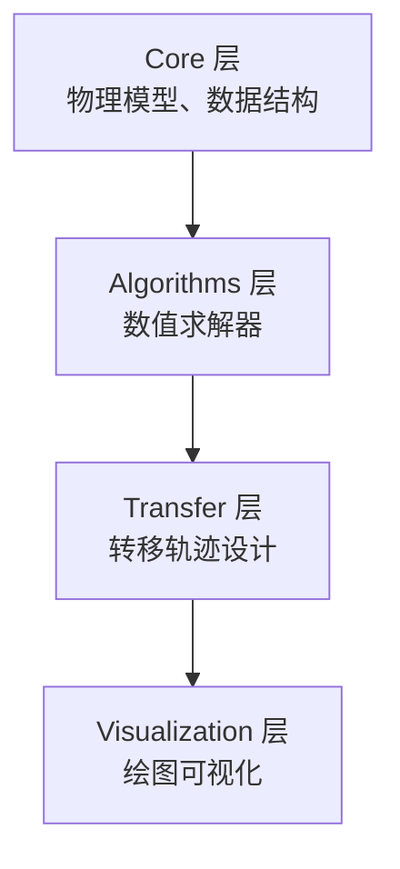

# e2m2e MBSE 系统模型总览

## 系统描述

e2m2e (Earth to Moon, Moon to Earth) 是基于 CR3BP (Circular Restricted Three-Body Problem) 的地月转移轨道设计 Python 库。提供系统建模、数值算法、转移轨迹设计和可视化功能。

## 架构层次

| 层 | 模块 | 职责 |
|----|------|------|
| Core | system, dynamics, orbit, coordinate, spice | 物理模型、数据结构 |
| Algorithms | differential_correction, continuation, stability, multiple_shooting, strategies | 数值求解器 |
| Transfer | transfer_search, transfer_optimization, transfer | 转移轨迹设计 |
| Visualization | config, base, family, transfer, stability | 绘图可视化 |

## Protocol 接口

| Protocol | 方法 | 实现者 |
|----------|------|--------|
| SystemModel | `mu`, `get_jacobi_constant` | `CR3BP_System`, `EphemerisSystem` |
| Propagator | `propagate()` | `CR3BP_Dynamics`, `EphemerisDynamics` |
| EOMProvider | `equations_of_motion()`, `equations_with_stm()` | `CR3BP_Dynamics`, `EphemerisDynamics` |
| OrbitContainer | `states`, `times`, `period` | `Orbit`, `OrbitFamily` |
| CorrectorStrategy | `CorrectionConfig` | `symmetric_2d_*`, `symmetric_3d_*`, `halo_*` |
| Visualizer | `plot()` | `OrbitVisualizer`, `FamilyPlotter`, `TransferPlotter` |

## 数据模型

基于 Pydantic 的统一数据结构：

| 模型 | 用途 |
|------|------|
| `PropagationResult` | 传播结果（states, stm, jacobi） |
| `OrbitProperties` | 轨道属性（周期、振幅、极值） |
| `OrbitStability` | 稳定性分析结果（单值矩阵、特征值） |
| `JacobiResult` | Jacobi 常数计算结果 |
| `SystemConfig` | 系统配置参数 |
| `SearchConfig` | 搜索配置参数 |
| `TransferConfig` | 转移配置参数 |

## 需求统计

| 层 | 需求范围 | 数量 | 验证方法 |
|----|----------|------|----------|
| Core | REQ-001 ~ REQ-026 | 14 条 | test / analysis / inspection |
| Algorithms | REQ-100 ~ REQ-113 | 10 条 | test / inspection |
| **总计** | | **24 条** | **覆盖率 100%** |

## SysML 图表索引

| 图表类型 | 文件 | 内容 |
|----------|------|------|
| BDD | [bdd-core.md](bdd-core.md) | Core 层块定义图 |
| BDD | [bdd-algorithms.md](bdd-algorithms.md) | Algorithms 层块定义图 |
| 需求图 | [requirements.md](requirements.md) | 需求分解与追溯 |
| 状态机 | [state-convergence.md](state-convergence.md) | 微分修正收敛状态 |
| 状态机 | [state-orbit-lifecycle.md](state-orbit-lifecycle.md) | 轨道生命周期 |
| 活动图 | [activity-orbit-design.md](activity-orbit-design.md) | 轨道设计工作流 |
| 活动图 | [activity-differential-correction.md](activity-differential-correction.md) | 微分修正迭代流程 |
| 序列图 | [sequence-propagation.md](sequence-propagation.md) | 传播交互序列 |
| 序列图 | [sequence-correction.md](sequence-correction.md) | 微分修正交互序列 |
| 追溯矩阵 | [traceability-matrix.md](traceability-matrix.md) | 需求-代码-测试追溯 |
