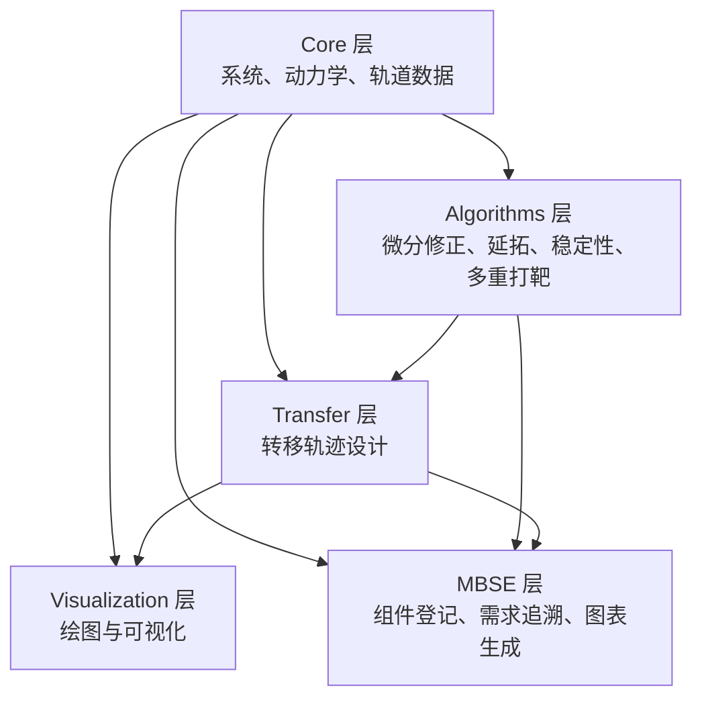

# e2m2e MBSE 模型总览

## 什么是 MBSE

**MBSE（基于模型的系统工程，Model-Based Systems Engineering）** 是一种以形式化模型为核心、贯穿需求、设计、分析、验证与确认全生命周期的系统工程方法。与传统以文档为中心的系统工程不同，MBSE 把系统要素之间的关系做成模型元素间的显式关联，可自动检查、可追溯；建模语言通常用 SysML（需求、行为、结构、参数四个维度）。

e2m2e 不是面向完整系统工程流程的 MBSE 工具，而是**借鉴 MBSE 思路**，在仓库内用轻量方式做四件事：

- **组件登记**（`ComponentRegistry`）——汇总各模块的职责与依赖；
- **需求追溯**（`RequirementRegistry`）——把需求连到代码与测试；
- **数据模型**（Pydantic）——统一传播结果、轨道属性等数据结构；
- **图表生成**（`DiagramGenerator`）——从上述模型生成 BDD、需求图、活动图、序列图、状态机的 Mermaid 文档。

本页及 `docs/reference/mbse/` 下的各图，就是这套轻量 MBSE 模型的产物。

## 系统描述

e2m2e (Earth to Moon, Moon to Earth) 是用于地月空间轨道与转移轨道设计的 Python 库。它以 CR3BP 系统和星历系统为计算上下文，提供动力学传播、周期轨道生成、轨道转移设计和可视化能力。

## 架构层次

| 层 | 模块 | 职责 |
|----|------|------|
| Core | system, dynamics, orbit, coordinate, spice | 物理模型、传播能力、轨道数据结构 |
| Algorithms | differential_correction, continuation, stability, multiple_shooting, strategies | 数值求解与轨道族生成 |
| Transfer | transfer_search, transfer_optimization, transfer | 转移轨迹搜索与优化 |
| Visualization | config, base, family, transfer, stability | 绘图与可视化输出 |
| MBSE | architecture, requirements, data, diagrams | 组件登记、需求追溯、数据模型、Mermaid 图表生成 |

## 当前接缝

ADR-0001 撤销了装饰性的 Protocol 接缝。当前 MBSE 文档只描述真实存在的接口与实现关系：

| 接缝 | 接口 | 适配器 / 实现 | 用途 |
|------|------|---------------|------|
| 动力学传播 | `Dynamics` 基类 | `CR3BP_Dynamics`, `EphemerisDynamics` | 统一 `propagate()` 调用和方程钩子 |
| 组件登记 | `ComponentRegistry` | core / algorithms 组件定义 | 汇总模块职责与依赖关系 |
| 需求追溯 | `RequirementRegistry` | core / algorithms 需求定义 | 将需求连接到代码与测试 |
| 图表生成 | `DiagramGenerator` | BDD、需求图、活动图、序列图、状态机图 | 从 MBSE 模型生成 Mermaid 文档 |

## 数据模型

基于 Pydantic 的统一数据结构：

| 模型 | 用途 |
|------|------|
| `PropagationResult` | 传播结果（states, stm, jacobi） |
| `OrbitProperties` | 轨道属性（周期、振幅、极值） |
| `OrbitStability` | 稳定性分析结果（单值矩阵、特征值） |
| `JacobiResult` | Jacobi 常数计算结果 |
| `SystemConfig` | 系统配置参数 |
| `TransferConfig` | 转移配置参数（含搜索阶段 ``search_*`` 字段） |

## 需求统计

| 层 | 需求范围 | 数量 | 验证方法 |
|----|----------|------|----------|
| Core | REQ-001 ~ REQ-026 | 14 条 | test / analysis / inspection |
| Algorithms | REQ-100 ~ REQ-113 | 10 条 | test / inspection |
| **总计** | | **24 条** | **覆盖率 100%** |

## SysML 图表索引

| 图表类型 | 文件 | 内容 |
|----------|------|------|
| BDD | [bdd-core.md](bdd-core.md) | Core 层块定义图 |
| BDD | [bdd-algorithms.md](bdd-algorithms.md) | Algorithms 层块定义图 |
| 需求图 | [requirements.md](requirements.md) | 需求分解与追溯 |
| 状态机 | [state-convergence.md](state-convergence.md) | 微分修正收敛状态 |
| 状态机 | [state-orbit-lifecycle.md](state-orbit-lifecycle.md) | 轨道生命周期 |
| 活动图 | [activity-orbit-design.md](activity-orbit-design.md) | 轨道设计工作流 |
| 活动图 | [activity-differential-correction.md](activity-differential-correction.md) | 微分修正迭代流程 |
| 序列图 | [sequence-propagation.md](sequence-propagation.md) | 传播交互序列 |
| 序列图 | [sequence-correction.md](sequence-correction.md) | 微分修正交互序列 |
| 追溯矩阵 | [traceability-matrix.md](traceability-matrix.md) | 需求-代码-测试追溯 |
