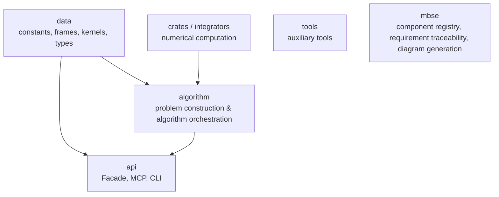

# e2m2e MBSE Model Overview

## What MBSE is

**MBSE (Model-Based Systems Engineering)** is a systems-engineering approach
centered on formal models spanning requirements, design, analysis, verification,
and validation across the whole lifecycle. e2m2e doesn't provide a full
systems-engineering process; it borrows the traceability mindset inside this
repo.

The MBSE model carries four duties:

- **Component registration** (`ComponentRegistry`) records components, their
  architecture layers, and component dependencies;
- **Requirement traceability** (`RequirementRegistry`) links requirements to code
  modules and test files;
- **Data models** (Pydantic) express MBSE's own data contracts;
- **Diagram generation** (`DiagramGenerator`) produces Mermaid diagrams and the
  traceability matrix from registered models.

BDDs, the requirements diagram, and the traceability matrix are managed,
generated artifacts. After re-running the MBSE documentation generation script,
committed artifacts must remain unchanged; activity/sequence/state diagrams are
supplementary narrative outside that generation check.

## Architecture layers

Runtime code follows ADR 0011's five-layer architecture; MBSE is an independent
top-level architecture-metadata subsystem outside the runtime dependency chain:

| Layer | Responsibility |
|----|------|
| data | spacetime references, physical constants, SPICE kernels, data containers |
| numerical | Rust numerical computation + Python bindings |
| algorithm | dynamics, correction, continuation, stability, mission problem construction |
| api | Facade, MCP, CLI & boundary models |
| tools | auxiliary capabilities not depended on by core runtime code |
| mbse | component registry, requirement traceability, Pydantic models, doc generation |

## Current seams

ADR 0001 withdrew decorative Protocol seams. MBSE describes existing module
relations via two registries plus one generator:

| Seam | Interface | Purpose |
|------|------|------|
| Default model assembly | `register_default_model` | Registers official requirements & component catalog into caller-provided registries |
| Component registration | `ComponentRegistry` | Aggregates components' module locations, architecture layers, dependencies |
| Requirement traceability | `RequirementRegistry` | Connects requirements to code modules & test files |
| Documentation generation | `DiagramGenerator` | Generates BDDs, requirement diagrams, traceability matrix from registered models |

## Data models

| Model | Purpose |
|------|------|
| `OrbitProperties` | Orbit properties: period, amplitude, extremes, mean state, center & periodicity |

`OrbitProperties.mean_state` is a shape-`(6,)` state vector; `center` a shape-
`(3,)` position vector. The model validates these public contracts at
construction.

## Managed artifacts

| Document | Content |
|------|------|
| [Data-layer BDD](generated/bdd-data.md) | Data containers & SPICE kernel management components |
| [Numerical-layer BDD](generated/bdd-numerical.md) | Rust numerical-computation facade |
| [Algorithm-layer BDD](generated/bdd-algorithm.md) | Dynamics, correction, continuation & stability components |
| [Interface-layer BDD](generated/bdd-api.md) | Facade, CLI & MCP interfaces |
| [Tools-layer BDD](generated/bdd-tools.md) | Auxiliary tools such as logging |
| [Functional requirements](generated/requirements.md) | Requirement diagram & code satisfaction relations |
| [Traceability matrix](generated/traceability-matrix.md) | Requirements ↔ code modules ↔ test files |
