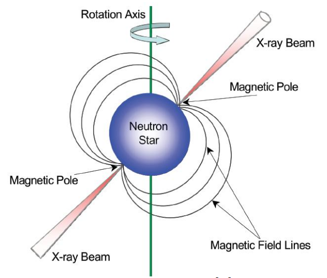

# X 射线脉冲星导航

> 本文作者：[天疆说](https://gitee.com/cislunarspace)
>
> 本站地址：[https://cislunarspace.cn](https://cislunarspace.cn)

## X 射线脉冲星导航的基本概念

脉冲星是一种高速自旋的中子星。大于1.4个太阳质量的恒星演化到晚期，由于其内部核原料的大量消耗，辐射压大幅降低，难以抗衡引力，从而引起塌缩，形成了诸如白矮星、中子星和黑洞等致密星[2]。其中，一颗相当于太阳质量的中子星的直径大约为$10\mathrm{km}$，核心密度达到$10^{12}\mathrm{kg/cm}^3$，磁场强度可达$10^4\sim10^{13}$Gauss[3]。

脉冲星的自转轴和磁轴不重合，两个磁极可发射辐射波束。当星体自转且磁极波束扫过测量设备时，测量设备就可接收到一个脉冲信号，犹如海上为船舶导航的灯塔一样。脉冲星自转周期的长期稳定性极佳，若干毫秒脉冲星自转周期的长期稳定度可媲美当前的原子钟。具有X射线频段辐射的脉冲星称为X射线脉冲星。X射线属于高能射线，易于小型化探测设备，但难以穿过稠密的地球大气，因此只能在外部空间进行观测[4]。

通过在太阳系质心（Solar System Barycenter, SSB）处建立脉冲星的时间相位模型，可以推断出任一脉冲到达 SSB 的时间。同时，通过在轨处理光子测量数据，可以得到该脉冲到达航天器的时间。测量时间和预估时间之差，反映了航天器相对于 SSB 的位置在脉冲星方向上的投影。通过处理不同方向的测量信息，可以估计出航天器的位置和时间。通过对比脉冲星的方位测量信息与脉冲星在惯性空间的方向矢量，可以确定出航天器的体系相对于惯性系的姿态。

作为天文导航的一种，X射线脉冲星导航具有天文导航的共性特点：自主性强、抗干扰能力强、可靠性高、可同步定位定姿、导航误差不随时间积累。除此之外，X射线脉冲星导航还具有独特的优势，主要体现在以下几个方面：

（1）提供高精度的参考时间基准。X射线脉冲星的自转周期高度稳定。对部分毫秒脉冲星而言，若观测周期大于8年，其长期稳定度可达到$10^{-15}$量级[5]。利用脉冲星的观测信息，一方面可以通过建立综合脉冲星时来维持航天器导航系统时间，另一方面可在实现航天器定位的同时校正星载原子钟钟差。

（2）导航精度高。传统天文导航方法通过测量参考天体与航天器的空间角来实现航天器定位，其导航精度依赖于航天器到参考天体的距离。对处于巡航段的深空探测器，传统天文导航方法仅能获得几千公里的定位精度。然而，在相同情况下，X射线脉冲星导航的精度可优于十公里。

除此之外，同卫星导航相比，X射线脉冲星导航还具有可同时服务于近地航天器、深空探测器的优势。

## 脉冲星参数测定及相关理论的研究进展

精准测定 X 射线脉冲星的空间分布、辐射特性及自转周期特性等信息是开展 X 射线脉冲星导航研究的前提条件。脉冲星辐射的 X 射线能量范围为 $0.1\sim200\,\text{keV}$（$0.1\sim20\,\text{keV}$ 为软 X 射线，$20\sim200\,\text{keV}$ 为硬 X 射线[6]）。一般认为，软 X 射线适用于 X 射线脉冲星导航。为了充分利用现有的地面、空间观测资源，建议选择能够同时辐射射电信号（可穿透大气层）和 X 射线信号的脉冲星作为导航脉冲星。通过地面的射电观测可以测定脉冲星的空间分布、自转周期特性等信息；通过发射航天器可以测定脉冲星在 X 射线频段的轮廓和相位等信息。

### 脉冲星的发现、命名及分类

#### 脉冲星的发现

1967年，剑桥大学的研究生Bell在分析行星际闪烁观测数据时，意外地在没有已知射电源的方向上，发现了一系列周期信号，并将这一结果报告给其导师Hewish教授。Bell和Hewish曾设想这种周期信号是外星人发来的讯息。但研究小组接收到的脉冲信号仅包含地球公转产生的频移，没有发射源的运动信息。因此，最终确认该种信号源为太阳系外的自然天体。1968年，Hewish和Bell将该发现发表在Nature上，并将发现的天体射电源命名为脉冲星[7]。脉冲星是20世纪60年代天文领域的四大发现之一，开启了一个新兴的天文研究领域，并对现代天体物理学产生了深远的影响。1974年，Hewish教授因发现脉冲星获得诺贝尔物理学奖。

#### 脉冲星的命名

现在的脉冲星名称可表示为“PSR 参考历元 脉冲星赤经 脉冲星赤纬”，其中，北赤纬为“$+$”，南赤纬为“$-$”，赤纬的有效数字为 $0.1^\circ$ 或 $0.01^\circ$。因此，Bell 发现的第一颗脉冲星命名为 $\text{PSR}~1919+16$。此外，在某些球状星团中，发现的脉冲星位置相差无几，难以用位置清楚区分，就在坐标后附加一个字母来区分。同恒星的位置标定类似，脉冲星的赤经赤纬也要考虑参考历元。以前的星表大多采用贝塞尔年年首作为历元，记为 $B$。例如历元 $B~1900.0$、$B~1950.0$ 等。国际天文联合会（International Astronomical Union，IAU）规定自 $1984$ 年起，星表统一采用儒略年年首作为历元，记为 $J$。目前采用历元 $J~2000.0$。对于 $1993$ 年以前发现的脉冲星，两种历元均可使用，分别以 $B$ 和 $J$ 加以区别。$1993$ 年以后发现的脉冲星仅使用历元 $J$。

---

有待完善……

## 参考文献

[1] 王奕迪. X射线脉冲星信号处理与导航方法研究[D]. 长沙: 国防科学技术大学, 2016.

[2] 李黎. 基于X射线脉冲星的航天器自主导航方法研究[D]. 长沙: 国防科学技术大学, 2007.

[3] Manchester R N, Hobbs G B, Teoh A, et al. The Australia telescope national facility pulsar catalogue[J]. Astronomical Journal, 2005, 129(4): 1993-2006.

[4] 朱慈墭. 天文学教程[M]. 北京: 高等教育出版社, 2003.

[5] Kaspi V M, Taylor J H, Ryba M F. High-precision timing of millisecond pulsars. III. Long-term monitoring of PSRs B1855+09 and B1937+21[J]. Astrophysical Journal, 1994, 428: 713.

[6] 王绶绾, 周又元. X射线天体物理学[M]. 北京: 科学出版社, 1999.

[7] Hewish A, Bell S J, Pilkington J D H, et al. Observation of a rapidly pulsating radio source[J]. Nature, 1968, 217(5130): 709-713.
