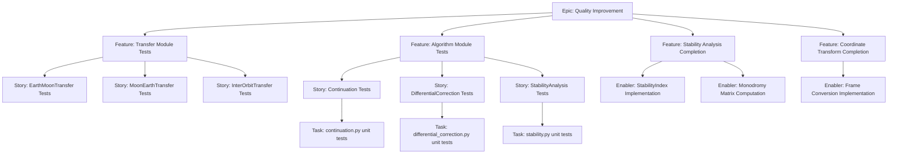
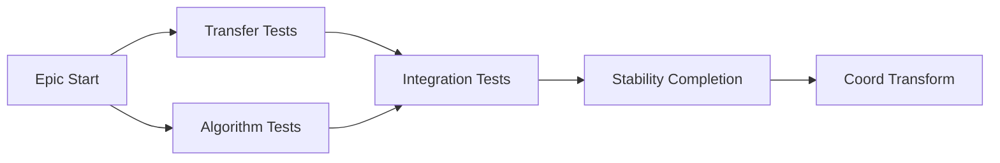

# Project Plan: e2m2e Quality Improvement & Test Coverage

## 1. Project Overview

### Feature Summary
Improve code quality, test coverage, and complete incomplete features in the e2m2e orbital mechanics library.

### Success Criteria
- Test coverage for all public modules (transfer, algorithms) >80%
- All TODO comments addressed or tracked in issues
- All NotImplementedError cases either implemented or documented
- Stable API with backward compatibility

### Key Milestones
1. Transfer module test coverage
2. Algorithm module test coverage  
3. Stability analysis completion
4. Coordinate transformation completion
5. Documentation update

### Risk Assessment
- **Risk**: Some features may require API changes that break backward compatibility
- **Mitigation**: Version bump and deprecation warnings before removal
- **Risk**: Complex orbital mechanics may make testing difficult
- **Mitigation**: Use integration tests with known orbital solutions

---

## 2. Work Item Hierarchy



---

## 3. GitHub Issues Breakdown

### Epic Issue Template

```markdown
# Epic: e2m2e Quality Improvement

## Epic Description

Improve code quality, test coverage, and complete incomplete features across the e2m2e orbital mechanics library.

## Business Value

- **Primary Goal**: Increase project reliability and maintainability
- **Success Metrics**: >80% test coverage on core modules
- **User Impact**: More stable library for researchers and engineers

## Epic Acceptance Criteria

- [ ] All transfer modules have >80% test coverage
- [ ] All algorithm modules have >80% test coverage
- [ ] All TODOs addressed or converted to tracked issues
- [ ] All NotImplementedError cases resolved

## Features in this Epic

- [ ] #{issue} - Transfer Module Tests
- [ ] #{issue} - Algorithm Module Tests
- [ ] #{issue} - Stability Analysis Completion
- [ ] #{issue} - Coordinate Transform Completion

## Definition of Done

- [ ] All feature stories completed
- [ ] Test coverage metrics met
- [ ] Documentation updated
- [ ] No new TODOs introduced

## Labels

`epic`, `priority-high`, `quality`

## Milestone

v0.2.0

## Estimate

XL
```

### Feature Issue Template

```markdown
# Feature: Transfer Module Test Coverage

## Feature Description

Add comprehensive unit and integration tests for all transfer orbit modules.

## User Stories in this Feature

- [ ] #{issue} - EarthMoonTransfer Tests
- [ ] #{issue} - MoonEarthTransfer Tests
- [ ] #{issue} - InterOrbitTransfer Tests

## Technical Enablers

N/A - User-facing feature testing

## Dependencies

**Blocked by**: None
**Blocks**: Algorithm Module Tests (can run in parallel)

## Acceptance Criteria

- [ ] EarthMoonTransfer has >80% coverage
- [ ] MoonEarthTransfer has >80% coverage
- [ ] InterOrbitTransfer has >80% coverage
- [ ] Integration tests with known solutions pass

## Definition of Done

- [ ] All transfer classes tested
- [ ] Test fixtures established
- [ ] Integration tests with reference solutions

## Labels

`feature`, `priority-high`, `testing`, `transfer`

## Epic

#{epic-issue-number}

## Estimate

M (13-20 story points)
```

---

## 4. Priority and Value Matrix

| Priority | Value  | Criteria                                      | Labels                          |
| -------- | ------ | -------------------------------------------- | ------------------------------- |
| P0       | High   | Critical path - transfer tests               | `priority-critical`, `value-high` |
| P1       | High   | Core functionality - algorithm tests         | `priority-high`, `value-high`     |
| P1       | Medium | Core functionality - stability completion    | `priority-high`, `value-medium`   |
| P2       | Medium | Important but not blocking - coord transform  | `priority-medium`, `value-medium` |
| P3       | Low    | Nice to have - documentation                 | `priority-low`, `value-low`       |

---

## 5. Estimation Guidelines

### Story Point Scale (Fibonacci)

- **1 point**: Simple test case, <4 hours
- **2 points**: Standard unit test, <1 day
- **3 points**: Multiple test scenarios, 1-2 days
- **5 points**: Complex integration test, 3-5 days
- **8 points**: Complete module coverage, 1-2 weeks
- **13+ points**: Epic-level work, needs breakdown

### T-Shirt Sizing (Epics/Features)

- **Transfer Module Tests**: L (20-40 story points)
- **Algorithm Module Tests**: L (20-40 story points)
- **Stability Analysis**: M (8-20 story points)
- **Coordinate Transform**: S (3-8 story points)

---

## 6. Dependency Management



### Dependency Types

- **Blocks**: Transfer/Algorithm tests must complete before integration tests
- **Related**: Stability and Coord Transform can run in parallel
- **Parallel**: Transfer and Algorithm tests are independent

---

## 7. Sprint Planning Template

### Sprint 1: Transfer Module Coverage
- **Stories**: EarthMoonTransfer, MoonEarthTransfer, InterOrbitTransfer tests
- **Total**: ~20 story points
- **Focus**: Get transfer module to >80% coverage

### Sprint 2: Algorithm Module Coverage
- **Stories**: Continuation, DifferentialCorrection, StabilityAnalysis tests
- **Total**: ~20 story points
- **Focus**: Get algorithm module to >80% coverage

### Sprint 3: Feature Completion
- **Stories**: StabilityIndex, MonodromyMatrix, FrameConversion
- **Total**: ~15 story points
- **Focus**: Complete incomplete implementations

---

## 8. GitHub Project Board Configuration

### Column Structure (Kanban)
1. **Backlog**: Prioritized and ready for planning
2. **Sprint Ready**: Detailed and estimated, ready for development
3. **In Progress**: Currently being worked on
4. **In Review**: Code review, testing, or stakeholder review
5. **Testing**: QA validation and acceptance testing
6. **Done**: Completed and accepted

### Custom Fields Configuration
- **Priority**: P0, P1, P2, P3
- **Value**: High, Medium, Low
- **Component**: Transfer, Algorithms, Core, Visualization
- **Estimate**: Story points (1, 2, 3, 5, 8, 13)
- **Test Coverage**: Current %, Target %

---

## 9. Automation and GitHub Actions

### Automated Test Coverage Reporting

```yaml
name: Test Coverage Report

on:
  push:
    branches: [main]
  pull_request:
    branches: [main]

jobs:
  coverage:
    runs-on: ubuntu-latest
    steps:
      - uses: actions/checkout@v4
      - name: Set up Python
        uses: actions/setup-python@v5
        with:
          python-version: '3.11'
      - name: Install dependencies
        run: |
          pip install -e ".[dev]"
          pip install pytest-cov
      - name: Run tests with coverage
        run: |
          pytest --cov=e2m2e --cov-report=xml --cov-report=html tests/
      - name: Upload coverage to Codecov
        uses: codecov/codecov-action@v4
        with:
          files: ./coverage.xml
```

---

## Appendix: Halo orbit roadmap

Feature work for Halo single-orbit generation, pseudo-arclength continuation (MATLAB `continuation_PAL_CR3BP` alignment), CLI scripts, and follow-up tests is tracked in:

- Chinese roadmap: [halo-roadmap_zh.md](../../halo-roadmap_zh.md)
- Feature overview (EN): [halo_en.md](../../../../algorithms/halo_en.md)

Tie-in: extend the **Algorithm module tests** epic with PAL / `generate_halo_seed_orbit` regression cases when feasible.

---

## Issue Creation Checklist

### Pre-Creation Preparation
- [x] Feature artifacts complete: This project plan
- [x] Epic exists: Epic issue created with proper labels and milestone
- [ ] Project board configured: Kanban columns, custom fields
- [ ] Team capacity assessed: 3 sprints planned

### Epic Level Issues
- [ ] **Epic issue created** with comprehensive description
- [ ] **Epic milestone created** with target release date (v0.2.0)
- [ ] **Epic labels applied**: `epic`, `priority-high`, `quality`
- [ ] **Epic added to project board** in appropriate column

### Feature Level Issues
- [ ] **Feature issue: Transfer Module Tests** linking to parent epic
- [ ] **Feature issue: Algorithm Module Tests** linking to parent epic
- [ ] **Feature issue: Stability Analysis Completion** linking to parent epic
- [ ] **Feature issue: Coordinate Transform Completion** linking to parent epic

### Story/Enabler Level Issues
- [ ] **Transfer Stories**: EarthMoonTransfer, MoonEarthTransfer, InterOrbitTransfer
- [ ] **Algorithm Stories**: Continuation, DifferentialCorrection, StabilityAnalysis
- [ ] **Enablers**: StabilityIndex, MonodromyMatrix, FrameConversion
