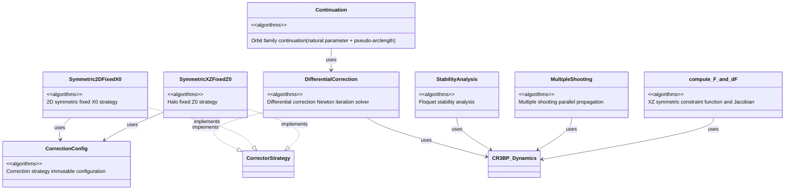

```mermaid
classDiagram
    class DifferentialCorrection {
        &lt;&lt;algorithms&gt;&gt;
        Differential correction Newton iteration solver
    }
    DifferentialCorrection ..|> CorrectorStrategy : implements
    DifferentialCorrection --> CR3BP_Dynamics : uses
    class CorrectionConfig {
        &lt;&lt;algorithms&gt;&gt;
        Correction strategy immutable configuration
    }
    class Symmetric2DFixedX0 {
        &lt;&lt;algorithms&gt;&gt;
        2D symmetric fixed X0 strategy
    }
    Symmetric2DFixedX0 ..|> CorrectorStrategy : implements
    Symmetric2DFixedX0 --> CorrectionConfig : uses
    class SymmetricXZFixedZ0 {
        &lt;&lt;algorithms&gt;&gt;
        Halo fixed Z0 strategy
    }
    SymmetricXZFixedZ0 ..|> CorrectorStrategy : implements
    SymmetricXZFixedZ0 --> CorrectionConfig : uses
    class Continuation {
        &lt;&lt;algorithms&gt;&gt;
        Orbit family continuation (natural parameter + pseudo-arclength)
    }
    Continuation --> DifferentialCorrection : uses
    class StabilityAnalysis {
        &lt;&lt;algorithms&gt;&gt;
        Floquet stability analysis
    }
    StabilityAnalysis --> CR3BP_Dynamics : uses
    class MultipleShooting {
        &lt;&lt;algorithms&gt;&gt;
        Multiple shooting parallel propagation
    }
    MultipleShooting --> CR3BP_Dynamics : uses
    class compute_F_and_dF {
        &lt;&lt;algorithms&gt;&gt;
        XZ symmetric constraint function and Jacobian
    }
    compute_F_and_dF --> CR3BP_Dynamics : uses
```
