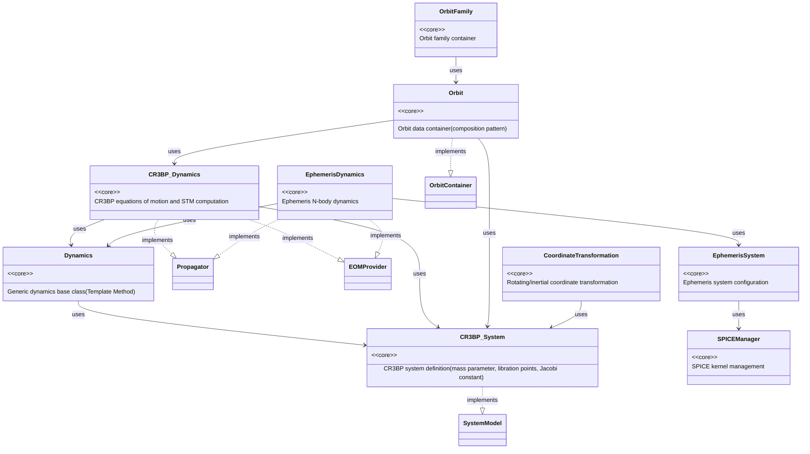

```mermaid
classDiagram
    class CR3BP_System {
        &lt;&lt;core&gt;&gt;
        CR3BP system definition (mass parameter, libration points, Jacobi constant)
    }
    CR3BP_System ..|> SystemModel : implements
    class Dynamics {
        &lt;&lt;core&gt;&gt;
        Generic dynamics base class (Template Method)
    }
    Dynamics --> CR3BP_System : uses
    class CR3BP_Dynamics {
        &lt;&lt;core&gt;&gt;
        CR3BP equations of motion and STM computation
    }
    CR3BP_Dynamics ..|> Propagator : implements
    CR3BP_Dynamics ..|> EOMProvider : implements
    CR3BP_Dynamics --> Dynamics : uses
    CR3BP_Dynamics --> CR3BP_System : uses
    class EphemerisDynamics {
        &lt;&lt;core&gt;&gt;
        Ephemeris N-body dynamics
    }
    EphemerisDynamics ..|> Propagator : implements
    EphemerisDynamics ..|> EOMProvider : implements
    EphemerisDynamics --> Dynamics : uses
    EphemerisDynamics --> EphemerisSystem : uses
    class Orbit {
        &lt;&lt;core&gt;&gt;
        Orbit data container (composition pattern)
    }
    Orbit ..|> OrbitContainer : implements
    Orbit --> CR3BP_System : uses
    Orbit --> CR3BP_Dynamics : uses
    class OrbitFamily {
        &lt;&lt;core&gt;&gt;
        Orbit family container
    }
    OrbitFamily --> Orbit : uses
    class CoordinateTransformation {
        &lt;&lt;core&gt;&gt;
        Rotating/inertial coordinate transformation
    }
    CoordinateTransformation --> CR3BP_System : uses
    class SPICEManager {
        &lt;&lt;core&gt;&gt;
        SPICE kernel management
    }
    class EphemerisSystem {
        &lt;&lt;core&gt;&gt;
        Ephemeris system configuration
    }
    EphemerisSystem --> SPICEManager : uses
```
