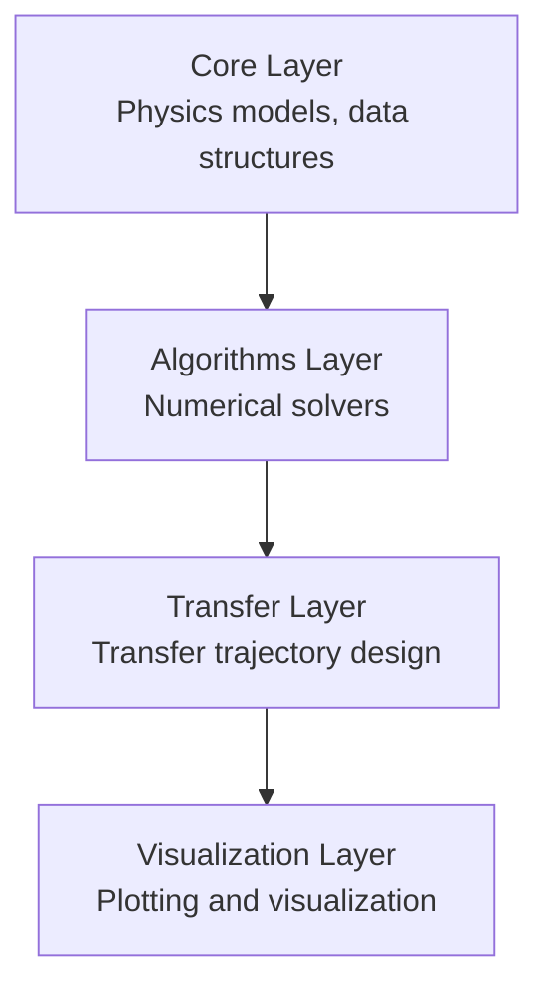

# e2m2e MBSE System Model Overview

## System Description

e2m2e (Earth to Moon, Moon to Earth) is a Python library for cislunar transfer orbit design based on the CR3BP (Circular Restricted Three-Body Problem). It provides system modeling, numerical algorithms, transfer trajectory design, and visualization capabilities.

## Architecture Layers

| Layer | Modules | Responsibility |
|-------|---------|----------------|
| Core | system, dynamics, orbit, coordinate, spice | Physics models, data structures |
| Algorithms | differential_correction, continuation, stability, multiple_shooting, strategies | Numerical solvers |
| Transfer | transfer_search, transfer_optimization, transfer | Transfer trajectory design |
| Visualization | config, base, family, transfer, stability | Plotting and visualization |

## Protocol Interfaces

| Protocol | Methods | Implementers |
|----------|---------|--------------|
| SystemModel | `mu`, `get_jacobi_constant` | `CR3BP_System`, `EphemerisSystem` |
| Propagator | `propagate()` | `CR3BP_Dynamics`, `EphemerisDynamics` |
| EOMProvider | `equations_of_motion()`, `equations_with_stm()` | `CR3BP_Dynamics`, `EphemerisDynamics` |
| OrbitContainer | `states`, `times`, `period` | `Orbit`, `OrbitFamily` |
| CorrectorStrategy | `CorrectionConfig` | `symmetric_2d_*`, `symmetric_3d_*`, `halo_*` |
| Visualizer | `plot()` | `OrbitVisualizer`, `FamilyPlotter`, `TransferPlotter` |

## Data Models

Pydantic-based unified data structures:

| Model | Purpose |
|-------|---------|
| `PropagationResult` | Propagation result (states, stm, jacobi) |
| `OrbitProperties` | Orbit properties (period, amplitude, extrema) |
| `OrbitStability` | Stability analysis result (monodromy matrix, eigenvalues) |
| `JacobiResult` | Jacobi constant computation result |
| `SystemConfig` | System configuration parameters |
| `SearchConfig` | Search configuration parameters |
| `TransferConfig` | Transfer configuration parameters |

## Requirement Statistics

| Layer | Requirement Range | Count | Verification Method |
|-------|-------------------|-------|---------------------|
| Core | REQ-001 ~ REQ-026 | 14 | test / analysis / inspection |
| Algorithms | REQ-100 ~ REQ-113 | 10 | test / inspection |
| **Total** | | **24** | **100% coverage** |

## SysML Diagram Index

| Diagram Type | File | Content |
|--------------|------|---------|
| BDD | [bdd-core.md](bdd-core.md) | Core layer block definition diagram |
| BDD | [bdd-algorithms.md](bdd-algorithms.md) | Algorithms layer block definition diagram |
| Requirement | [requirements.md](requirements.md) | Requirement decomposition and traceability |
| State Machine | [state-convergence.md](state-convergence.md) | Differential correction convergence state |
| State Machine | [state-orbit-lifecycle.md](state-orbit-lifecycle.md) | Orbit lifecycle |
| Activity | [activity-orbit-design.md](activity-orbit-design.md) | Orbit design workflow |
| Activity | [activity-differential-correction.md](activity-differential-correction.md) | Differential correction iteration flow |
| Sequence | [sequence-propagation.md](sequence-propagation.md) | Propagation interaction sequence |
| Sequence | [sequence-correction.md](sequence-correction.md) | Differential correction interaction sequence |
| Traceability Matrix | [traceability-matrix.md](traceability-matrix.md) | Requirement-code-test traceability |
