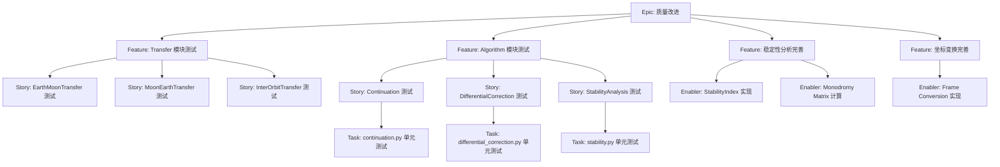
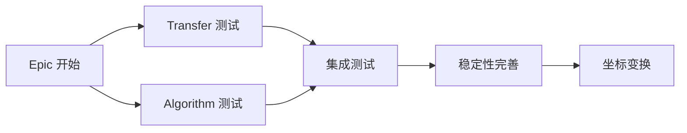

# 项目计划：e2m2e 质量改进与测试覆盖

## 1. 项目概述

### 功能摘要
提升 e2m2e 轨道力学库的代码质量、测试覆盖率，并完成不完整的功能。

### 成功标准
- 所有公共模块（transfer, algorithms）的测试覆盖率 >80%
- 所有 TODO 注释都已处理或在 issues 中跟踪
- 所有 NotImplementedError 案例都已实现或已记录
- 稳定的 API 和向后兼容性

### 关键里程碑
1. Transfer 模块测试覆盖率
2. Algorithm 模块测试覆盖率
3. 稳定性分析完善
4. 坐标变换完善
5. 文档更新

### 风险评估
- **风险**：某些功能可能需要 API 更改，从而破坏向后兼容性
- **缓解措施**：在移除之前进行版本升级和弃用警告
- **风险**：复杂的轨道力学可能使测试变得困难
- **缓解措施**：使用已知轨道解的集成测试

---

## 2. 工作项层次结构



---

## 3. GitHub Issues 分解

### Epic Issue 模板

```markdown
# Epic: e2m2e 质量改进

## Epic 描述

提升 e2m2e 轨道力学库的代码质量、测试覆盖率，并完成不完整的功能。

## 业务价值

- **主要目标**：提高项目可靠性和可维护性
- **成功指标**：核心模块测试覆盖率 >80%
- **用户影响**：为研究人员和工程师提供更稳定的库

## Epic 验收标准

- [ ] 所有 transfer 模块测试覆盖率 >80%
- [ ] 所有 algorithm 模块测试覆盖率 >80%
- [ ] 所有 TODO 已处理或转换为跟踪的 issues
- [ ] 所有 NotImplementedError 案例已解决

## 此 Epic 中的功能

- [ ] #{issue} - Transfer 模块测试
- [ ] #{issue} - Algorithm 模块测试
- [ ] #{issue} - 稳定性分析完善
- [ ] #{issue} - 坐标变换完善

## 完成定义

- [ ] 所有功能 story 已完成
- [ ] 测试覆盖率指标已达到
- [ ] 文档已更新
- [ ] 没有引入新的 TODO

## 标签

`epic`, `priority-high`, `quality`

## 里程碑

v0.2.0

## 估算

XL
```

### Feature Issue 模板

```markdown
# Feature: Transfer 模块测试覆盖率

## 功能描述

为所有转移轨道模块添加全面的单元测试和集成测试。

## 此功能中的用户故事

- [ ] #{issue} - EarthMoonTransfer 测试
- [ ] #{issue} - MoonEarthTransfer 测试
- [ ] #{issue} - InterOrbitTransfer 测试

## 技术支持

N/A - 用户面向功能测试

## 依赖关系

**被阻塞**：无
**阻塞**：Algorithm 模块测试（可并行运行）

## 验收标准

- [ ] EarthMoonTransfer 覆盖率 >80%
- [ ] MoonEarthTransfer 覆盖率 >80%
- [ ] InterOrbitTransfer 覆盖率 >80%
- [ ] 与已知解的集成测试通过

## 完成定义

- [ ] 所有 transfer 类已测试
- [ ] 测试夹具已建立
- [ ] 使用参考解的集成测试

## 标签

`feature`, `priority-high`, `testing`, `transfer`

## Epic

#{epic-issue-number}

## 估算

M (13-20 story points)
```

---

## 4. 优先级和价值矩阵

| 优先级 | 价值 | 标准 | 标签 |
| -------- | ------ | -------------------------------------------- | ------------------------------- |
| P0 | 高 | 关键路径 - transfer 测试 | `priority-critical`, `value-high` |
| P1 | 高 | 核心功能 - algorithm 测试 | `priority-high`, `value-high` |
| P1 | 中 | 核心功能 - 稳定性完善 | `priority-high`, `value-medium` |
| P2 | 中 | 重要但不阻塞 - coord transform | `priority-medium`, `value-medium` |
| P3 | 低 | 锦上添花 - 文档 | `priority-low`, `value-low` |

---

## 5. 估算指南

### Story Point 规模（斐波那契）

- **1 分**：简单测试用例，<4 小时
- **2 分**：标准单元测试，<1 天
- **3 分**：多个测试场景，1-2 天
- **5 分**：复杂集成测试，3-5 天
- **8 分**：完整模块覆盖，1-2 周
- **13+ 分**：Epic 级别工作，需要分解

### T 恤尺码（Epic/Feature）

- **Transfer 模块测试**：L（20-40 story points）
- **Algorithm 模块测试**：L（20-40 story points）
- **稳定性分析**：M（8-20 story points）
- **坐标变换**：S（3-8 story points）

---

## 6. 依赖关系管理



### 依赖类型

- **阻塞**：Transfer/Algorithm 测试必须在集成测试前完成
- **相关**：稳定性和坐标变换可并行运行
- **并行**：Transfer 和 Algorithm 测试相互独立

---

## 7. Sprint 计划模板

### Sprint 1: Transfer 模块覆盖率
- **Stories**: EarthMoonTransfer, MoonEarthTransfer, InterOrbitTransfer 测试
- **总计**：约 20 story points
- **重点**：使 transfer 模块达到 >80% 覆盖率

### Sprint 2: Algorithm 模块覆盖率
- **Stories**: Continuation, DifferentialCorrection, StabilityAnalysis 测试
- **总计**：约 20 story points
- **重点**：使 algorithm 模块达到 >80% 覆盖率

### Sprint 3: 功能完善
- **Stories**: StabilityIndex, MonodromyMatrix, FrameConversion
- **总计**：约 15 story points
- **重点**：完成未实现的实现

---

## 8. GitHub 项目看板配置

### 列结构（Kanban）
1. **Backlog**：已排序并准备好计划
2. **Sprint Ready**：已详细说明和估算，准备开发
3. **In Progress**：正在工作
4. **In Review**：代码审查、测试或相关方审查
5. **Testing**：QA 验证和验收测试
6. **Done**：已完成并接受

### 自定义字段配置
- **优先级**：P0, P1, P2, P3
- **价值**：高, 中, 低
- **组件**：Transfer, Algorithms, Core, Visualization
- **估算**：Story points (1, 2, 3, 5, 8, 13)
- **测试覆盖率**：当前 %, 目标 %

---

## 9. 自动化和 GitHub Actions

### 自动测试覆盖率报告

```yaml
name: Test Coverage Report

on:
  push:
    branches: [main]
  pull_request:
    branches: [main]

jobs:
  coverage:
    runs-on: ubuntu-latest
    steps:
      - uses: actions/checkout@v4
      - name: Set up Python
        uses: actions/setup-python@v5
        with:
          python-version: '3.11'
      - name: Install dependencies
        run: |
          pip install -e ".[dev]"
          pip install pytest-cov
      - name: Run tests with coverage
        run: |
          pytest --cov=e2m2e --cov-report=xml --cov-report=html tests/
      - name: Upload coverage to Codecov
        uses: codecov/codecov-action@v4
        with:
          files: ./coverage.xml
```

---

## 附录：Halo 轨道专题路线图

Halo 单轨生成、伪弧长延拓（`continuation_PAL_CR3BP` 对齐）、`generate_halo_family` 脚本及后续数值与测试工作，见独立文档：

- **[Halo 后续开发路线图](halo-roadmap)**（`docs/ways-of-work/halo-roadmap.md`）

与 **Algorithm 模块测试** Epic 的衔接建议：在 `tests/algorithms/` 中为 `continuation.py` 的 PAL 步与 `generate_halo_seed_orbit` 增加回归用例（见路线图「短期」一节）。

---

## Issue 创建检查清单

### 创建前准备
- [x] 功能工件完成：本项目计划
- [x] Epic 存在：带有适当标签和里程碑的 Epic issue 已创建
- [ ] 项目看板配置：Kanban 列、自定义字段
- [ ] 团队容量评估：已计划 3 个 sprint

### Epic 级别 Issues
- [ ] **Epic issue 已创建** 并有全面描述
- [ ] **Epic 里程碑已创建** 目标发布日期 (v0.2.0)
- [ ] **Epic 标签已应用**：`epic`, `priority-high`, `quality`
- [ ] **Epic 已添加到项目看板** 适当列中

### Feature 级别 Issues
- [ ] **Feature issue: Transfer 模块测试** 链接到父 epic
- [ ] **Feature issue: Algorithm 模块测试** 链接到父 epic
- [ ] **Feature issue: 稳定性分析完善** 链接到父 epic
- [ ] **Feature issue: 坐标变换完善** 链接到父 epic

### Story/Enabler 级别 Issues
- [ ] **Transfer Stories**: EarthMoonTransfer, MoonEarthTransfer, InterOrbitTransfer
- [ ] **Algorithm Stories**: Continuation, DifferentialCorrection, StabilityAnalysis
- [ ] **Enablers**: StabilityIndex, MonodromyMatrix, FrameConversion
