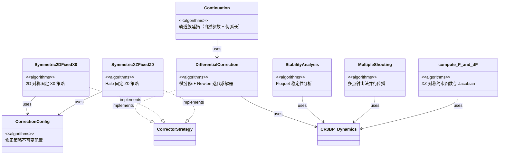

```mermaid
classDiagram
    class DifferentialCorrection {
        &lt;&lt;algorithms&gt;&gt;
        微分修正 Newton 迭代求解器
    }
    DifferentialCorrection ..|> CorrectorStrategy : implements
    DifferentialCorrection --> CR3BP_Dynamics : uses
    class CorrectionConfig {
        &lt;&lt;algorithms&gt;&gt;
        修正策略不可变配置
    }
    class Symmetric2DFixedX0 {
        &lt;&lt;algorithms&gt;&gt;
        2D 对称固定 X0 策略
    }
    Symmetric2DFixedX0 ..|> CorrectorStrategy : implements
    Symmetric2DFixedX0 --> CorrectionConfig : uses
    class SymmetricXZFixedZ0 {
        &lt;&lt;algorithms&gt;&gt;
        Halo 固定 Z0 策略
    }
    SymmetricXZFixedZ0 ..|> CorrectorStrategy : implements
    SymmetricXZFixedZ0 --> CorrectionConfig : uses
    class Continuation {
        &lt;&lt;algorithms&gt;&gt;
        轨道族延拓（自然参数 + 伪弧长）
    }
    Continuation --> DifferentialCorrection : uses
    class StabilityAnalysis {
        &lt;&lt;algorithms&gt;&gt;
        Floquet 稳定性分析
    }
    StabilityAnalysis --> CR3BP_Dynamics : uses
    class MultipleShooting {
        &lt;&lt;algorithms&gt;&gt;
        多点射击法并行传播
    }
    MultipleShooting --> CR3BP_Dynamics : uses
    class compute_F_and_dF {
        &lt;&lt;algorithms&gt;&gt;
        XZ 对称约束函数与 Jacobian
    }
    compute_F_and_dF --> CR3BP_Dynamics : uses
```
